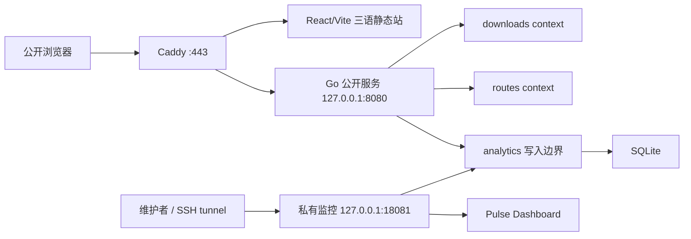

<div align="center">
  

# BusIsComing Website

BusIsComing Android App 的官方网站：介绍香港巴士路线规划与导航能力、提供基础路线试查，并交付当前 Android APK。

[访问官方网站](https://www.busiscoming.com/)

[](https://www.typescriptlang.org/)
[](https://react.dev/)
[](https://vite.dev/)
[](https://go.dev/)

</div>

## 项目概览

本仓库包含 BusIsComing 的公开主页、在线巴士路线试查、Android APK 下载服务，以及仅供维护者通过本机或 SSH 隧道访问的匿名统计 Dashboard。

当前能力包括：

- `zh-Hant`、`zh-Hans`、`en` 三语首页与隐私政策页；香港语境默认使用繁体中文。
- 响应式产品主页、五个核心产品故事、真实脱敏 App 截图和可访问的环形舞台交互。
- 由服务端代理 Citybus 与 DATA.GOV.HK 的基础路线和首程 ETA 试查。
- 受完整性校验保护的当前 Android APK metadata 与稳定下载入口。
- 只记录最小匿名事件的 SQLite 统计，以及绑定 loopback 的私有监控页面。
- OpenAPI-first 的服务端契约和面向单台 Ubuntu 服务器的 Caddy/systemd 部署脚本。

> [!IMPORTANT]
> 本网站是巴士路线规划与导航 App 的可信主页，不是通用交通平台。网站路线试查当前使用 Citybus 路线数据；符合条件的联营路线可呈现城巴、九巴与龙运首程抵站时间，但不等于完整支持其他运营商路线规划。产品定位不绑定单一运营商。

## 系统结构



后端以 `downloads`、`routes`、`analytics` 为 bounded context，并由 `internal/platform` 提供 HTTP 日志、recovery 和双 listener 监督。接口 schema、错误和缓存语义以 `shared/contracts/openapi/*.openapi.yaml` 为准。

完整边界见 [系统架构](docs/architecture.md)。

## 技术栈

| 范围 | 技术 |
| --- | --- |
| 公开前端与监控前端 | React 18、TypeScript 5.7、Vite 6 |
| 图表与端到端测试 | Recharts、Vitest、Testing Library、Playwright |
| 后端 | Go 1.26.3、Gin、modernc SQLite |
| 接口契约 | OpenAPI 3.1、Redocly |
| 生产部署 | Ubuntu 24.04、Caddy、systemd、SSH/SCP |

## 快速开始

### 前置条件

- Node.js 与 npm，版本需兼容 `frontend/package-lock.json`
- Go 1.26.3
- Git

安装前端依赖：

```bash
npm --prefix frontend install
```

启动后端：

```bash
cd backend
go run ./cmd/server
```

默认会启动：

- 公开 API：`http://127.0.0.1:8080`
- 私有监控服务：`http://127.0.0.1:18081`

在另一个终端启动公开前端：

```bash
npm --prefix frontend run dev
```

打开 `http://localhost:5173/`，开发服务器会跳转到 `/zh-hant/`，并把 `/api/*` 代理到公开后端。

如需开发监控页面，再启动：

```bash
npm --prefix frontend run dev:monitor
```

打开 `http://127.0.0.1:5174/`。本地统计写入需要有效的 `BUS_ANALYTICS_VISITOR_SECRET`；缺失时公开功能仍可用，统计以 degraded 方式关闭。

> [!WARNING]
> 不要把生产 token、visitor secret、服务器环境文件或第三方完整响应提交到仓库或粘贴到日志。

完整环境变量、启动组合和调试说明见 [本地开发](docs/development.md)。

## 常用验证

| 范围 | 命令 |
| --- | --- |
| 前端单元测试 | `npm --prefix frontend run test` |
| 公开前端与监控前端构建 | `npm --prefix frontend run build` |
| 公开页面 E2E | `npm --prefix frontend run test:e2e` |
| 监控页面 E2E | `npm --prefix frontend run test:e2e:monitor` |
| 后端测试 | `(cd backend && go test ./...)` |
| OpenAPI lint | `npm --prefix frontend run openapi:lint` |
| OpenAPI bundle | `npm --prefix frontend run openapi:bundle` |
| 本地生成 API HTML | `npm --prefix frontend run openapi:docs` |
| 部署脚本测试 | `scripts/tests/deploy_test.sh` |

`openapi:docs` 生成的 `shared/contracts/openapi/docs/` 是本地预览产物，不是接口权威来源，也不进入版本控制。

## 项目目录

```text
.
├── frontend/                  # 公开主页、隐私页与私有 Pulse Dashboard
├── backend/                   # Go 服务、DDD contexts、当前 APK
├── shared/contracts/         # 长期 JSON Schema、UI contract 与 OpenAPI
├── specs/                    # Spec Kit feature 产物、Figma 与验证证据
├── docs/                     # 长期主题文档
├── scripts/                  # 本地与远端部署脚本
└── .specify/                 # Constitution、模板与 Spec Kit 配置
```

## 文档导航

| 文档 | 说明 |
| --- | --- |
| [文档治理](docs/documentation-governance.md) | 文件职责、权威来源和更新触发条件 |
| [系统架构](docs/architecture.md) | 前后端、DDD、公开/私有 listener 和持久化边界 |
| [本地开发](docs/development.md) | 环境变量、启动、测试、构建和 OpenAPI 工具 |
| [UI 风格指南](docs/ui-style-guide.md) | 品牌、布局、状态、双端与无障碍原则 |
| [本地化指南](docs/localization-guidelines.md) | 三语语气、路径、动态数据和回退规则 |
| [路线查询与 ETA](docs/route-query-and-eta.md) | Citybus 查询、P2P stop map、缓存与 ETA 降级 |
| [Android APK 交付](docs/android-apk-delivery.md) | metadata、更新脚本、下载、校验与回滚边界 |
| [匿名统计与私有监控](docs/analytics-and-privacy.md) | 事件、隐私、SQLite、fail-open 与 Dashboard 隔离 |
| [素材来源与维护](docs/asset-provenance.md) | 品牌图、真实截图、manifest 与脱敏规则 |
| [部署说明](docs/deployment.md) | Ubuntu、Caddy、systemd、不可变 release 与运维 |
| [SEO 首次提交](docs/seo-first-indexing.md) | sitemap、canonical、Search Console 与索引检查 |

## 事实与契约来源

- Android App 当前能力以 Android 主项目的当前源码与长期文档为准；网站运行时不读取 Android 工程路径。
- 网站当前行为以本仓库源码、配置和测试为准。
- 服务端 HTTP API 以 `shared/contracts/openapi/*.openapi.yaml` 为权威契约。
- 精确页面、组件和交互状态以对应 `specs/<feature>/` 中的 spec、Figma 引用和验证证据为准。
- 当前 APK 版本、文件大小和 SHA-256 只以 `backend/downloads/android/current.json` 与实际 APK 为准，不在说明文档重复维护。
