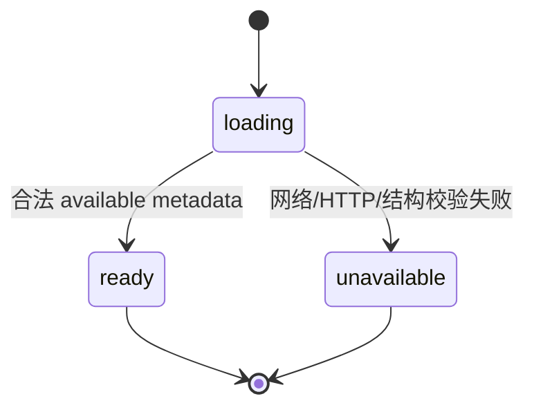

# Android APK 交付

本文记录网站当前 Android APK 的更新、metadata、完整性校验、前端入口和部署/回滚边界。当前版本号、文件大小、日期和 SHA-256 只以 `backend/downloads/android/current.json` 与实际 APK 为准，不在本文复制。

## 交付模型

网站只管理一个 current Android APK：

```text
backend/downloads/android/
├── BusIsComing.apk
└── current.json
```

生产环境对应文件位于部署根目录的 `shared/downloads/android/`。公开 API 包含：

- `GET /api/downloads/android/latest/metadata`
- `GET /api/downloads/android/latest`

精确 schema、错误、header 和匿名统计语义以 `shared/contracts/openapi/download-api.openapi.yaml` 为准。

## `current.json` 的职责

metadata 包含：

- platform、appName、applicationId；
- versionName、versionCode；
- fileName、relativePath；
- sizeBytes、三语 sizeLabel；
- sha256、lastUpdated、status；
- 本地更新来源 `sourcePath`。

`sourcePath` 只用于维护追溯，不能进入公开 metadata 响应。HTTP handler 只返回白名单字段和稳定 `downloadUrl`，不暴露服务器路径、构建路径或 SHA-256。

metadata 中的大小和 SHA-256 是下载完整性预期，不表示浏览器已完成下载或用户已安装 App。

## 替换当前 APK

从仓库根目录运行：

```bash
backend/scripts/update_android_apk.py /absolute/path/to/BusIsComing.apk
```

脚本执行：

1. 使用 Android SDK build-tools 的 `aapt dump badging` 读取 APK；
2. 解析 app label、applicationId、versionName、versionCode；
3. 把文件复制为固定名称 `backend/downloads/android/BusIsComing.apk`；
4. 计算实际大小和 SHA-256；
5. 使用当天日期整体写入 `current.json`。

> [!IMPORTANT]
> 当前脚本会读取并记录 applicationId，但不会把它与预期值自动比较。维护者必须检查输出和 `current.json`，确认 applicationId 为 BusIsComing 当前正式包名、版本递增符合发布计划且输入 APK 来源可信。

脚本会覆盖 current APK 和 metadata，不保留历史版本。执行前应确认目标文件，避免把调试包或错误 applicationId 发布为 current。

## 服务端读取与校验

### Metadata

metadata use case 只读取并验证公开字段：

- 文件存在且 JSON 可解析；
- platform/status、版本、文件名、大小、日期等满足 domain 约束；
- 响应只包含浏览器需要的白名单字段；
- 所有响应使用 `Cache-Control: no-store`。

metadata 请求不读取 APK bytes。缺失、不可读或字段无效分别映射为受控 404/500 错误。

### APK 下载

下载 use case：

1. 读取 current metadata；
2. 解析受管目录内的 basename，防止 metadata 路径逃逸；
3. 读取 APK；
4. 比较实际文件大小和 SHA-256；
5. 只有完整性一致才返回附件和版本 header。

成功响应包含 `Content-Disposition`、`Content-Length`、`X-APK-SHA256`、`X-APK-Version-Name` 和 `X-APK-Version-Code`。缺失、不可读或完整性不匹配时返回 JSON 错误，绝不返回部分或已知损坏的 APK。

repository 会按 metadata 与 APK 修改时间缓存已读取的 artifact bytes，避免每个请求重复读取和校验；任一文件修改时间变新后重新加载。

## 前端入口状态

精确三语首页由一个 `DownloadMetadataProvider` 包裹。它在同一 `document` 中共享一次 in-flight metadata 请求，React StrictMode 重挂载、Hero、中下部下载区和语言切换都复用该请求。



| 状态 | 元素语义 | 行为 |
| --- | --- | --- |
| `loading` | disabled button | 显示检查中，无 `href` |
| `ready` | `<a download>` | 使用 metadata 的稳定 `downloadUrl` 和 `fileName` |
| `unavailable` | disabled button | 显示暂不可用，无 `href` |

Hero 与中下部入口共用 `AndroidDownloadAction` 的行为，但保留各自布局。metadata 成功后，浏览器直接使用同源原生链接下载；前端不再：

- 对 APK URL 执行 `fetch`；
- 把完整 APK 读成 Blob；
- 创建 `blob:` object URL；
- 合成隐藏 anchor；
- 显示页面内伪下载进度。

metadata 是入口门禁，不是下载承诺。检查之后 APK 仍可能被替换、移除，或因网络/浏览器存储失败；原生链接无法让页面可靠得知最终落盘或安装结果。

## 匿名统计

- 合法主页 metadata 请求触发 `page_view` 事件；需要有效 `X-BusIsComing-Home-Locale` 才记录。
- APK GET 触发 `download_request`；成功归因使用本次实际响应的 versionName、versionCode 和 sizeBytes。
- 下载事件表示请求及 HTTP 结果，不表示用户已安装、启动或保留 App。
- 已知机器人不签发 visitor cookie，也不保存事件。
- 统计写入失败不改变 metadata 或 APK 响应。

详细隐私和 fail-open 边界见[匿名统计与私有监控](analytics-and-privacy.md)。

## 部署与回滚

代码 release 与 APK 是两个独立生命周期：

- 默认 `deploy` 构建并上传代码，同时替换远端 shared current APK。
- `deploy --skip-apk` 只在远端已有有效 current APK/metadata 时可用，不能初始化空服务器。
- `switch` 和 `rollback` 只切换 `current/previous` 代码 symlink，不回滚 shared APK。
- 部署健康检查失败会恢复代码 symlink；已经成功替换的 APK 不随之回滚。
- 如需同时恢复旧 APK，维护者必须用可信旧文件重新运行更新/部署流程，而不是假设代码 rollback 会处理。

完整生产步骤见[部署说明](deployment.md)。

## 更新后的验证

### 静态一致性

```bash
shasum -a 256 backend/downloads/android/BusIsComing.apk
wc -c backend/downloads/android/BusIsComing.apk
```

将结果与 `current.json` 对比，并人工确认 applicationId、versionName、versionCode、status、fileName 和日期。

### 自动化

```bash
cd backend
go test ./...

cd ../frontend
npm run test
npm run build
npm run test:e2e -- apk-metadata.spec.ts android-download.spec.ts
npm run openapi:lint
```

### HTTP

本地启动后检查：

```bash
curl -fsS http://127.0.0.1:8080/api/downloads/android/latest/metadata
curl -fSLo /tmp/BusIsComing.apk http://127.0.0.1:8080/api/downloads/android/latest
shasum -a 256 /tmp/BusIsComing.apk
```

临时下载文件不进入仓库。验证 response header、实际大小和 SHA-256，不仅检查 HTTP 200。

### 浏览器与 Android

发布下载行为变更时，在桌面 Chromium、390px 手机 viewport 和真实 Android Chrome 检查两处入口。只有在真实 Android 下载完成且 checksum/大小吻合时，才能声称真实设备下载已验证；不能把 Playwright 或 metadata 成功写成安装验证。

## 修改检查

改变 APK 文件、metadata 或下载实现时确认：

1. `current.json` 与实际文件一致且 applicationId 正确；
2. metadata 仍只暴露白名单，不泄露 `sourcePath`；
3. 下载在返回前完成大小和 SHA-256 校验；
4. 所有响应继续 `no-store`；
5. 两处前端入口共用同一状态和原生链接；
6. 页面不读取 APK bytes、不显示伪进度；
7. analytics 只声明下载请求，不声明安装；
8. OpenAPI、UI state contract、测试和部署边界同步。
