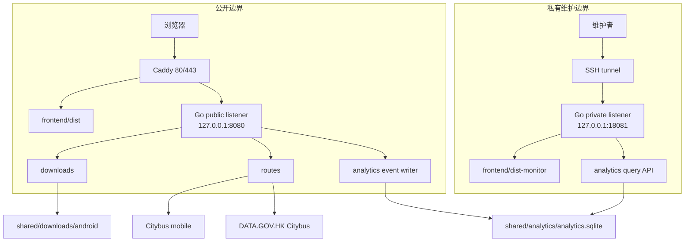

# 系统架构

本文记录 BusIsComing Website 当前长期架构、公开/私有网络边界、后端 DDD 组织和持久化归属。精确 endpoint、字段和错误以 `shared/contracts/openapi/*.openapi.yaml` 为准。

## 总体拓扑



生产环境中 Caddy 只公开三语静态站和公开 `/api/*`。它不代理 `18081`、`dist-monitor` 或 `/api/analytics/*`。私有 listener 只能绑定 loopback，维护者通过 SSH tunnel 访问。

## 前端边界

### 公开网站

公开 React 应用位于 `frontend/src/`，负责：

- 三语首页和隐私政策页；
- 产品内容、语言切换、SEO head 和 locale 路由；
- App 截图、功能介绍和联系入口；
- Citybus 试查交互和状态呈现；
- Android APK metadata 状态和原生下载链接。

构建过程先由 Vite 生成公开 bundle，再由 `frontend/scripts/generate-locale-pages.mjs` 生成三语首页与三语隐私页的静态 HTML。开发/预览服务器只对精确根路径返回到 `/zh-hant/` 的临时跳转；生产永久跳转由 Caddy 管理。

### 私有监控前端

Pulse Dashboard 位于 `frontend/src/monitoring/`，使用独立 Vite entry、样式 token、路由和 Playwright 配置。它只读取 private analytics API，不应被复制到公开静态目录或接入公开 Caddy route。

公开网站和 Dashboard 共享 BusIsComing 品牌基础，但面向不同任务：公开站帮助普通用户理解和试用 App；Dashboard 帮助维护者检查事件、性能和运行状态。

## 后端 composition root

`backend/cmd/server/main.go` 是服务组合入口，负责：

- 打开 analytics SQLite 并执行 migration；
- 根据 visitor secret 和写入配置启用或降级匿名统计；
- 建立公开与私有两个 Gin engine；
- 注册健康检查、下载、路线和私有 analytics 资源；
- 通过 supervisor 统一启动、观察和关闭两个 HTTP server。

公开 listener 是 required，失败会结束进程；私有 listener 是 optional，失败进入 degraded 报告但不能拖垮公开服务。两个 engine 都必须保留 request logging 和 panic recovery。

## Bounded contexts

### `downloads`

负责当前 Android APK 的 metadata、文件读取、SHA-256 完整性、HTTP 下载头和受控错误。文件系统只由 infrastructure 适配，domain/application 不依赖 Gin 或具体路径。

### `routes`

负责地点候选、签名 token、Citybus 路线聚合、P2P stop map、站名补齐、首程 ETA、缓存、限流、并发和局部降级。外部 HTML/JSON 解析留在 infrastructure，HTTP envelope 和错误状态码留在 interfaces。

### `analytics`

负责匿名事件模型、SQLite 写入/查询、visitor cookie、来源和设备分类、运行健康，以及私有监控查询。统计写入是公开请求的 fail-open 附属边界，不能改变公开业务响应。

### `platform`

`internal/platform/httpserver` 提供公开/私有 engine、结构化 request log、recovery、server supervisor 和 listener 状态归一化。它不承载下载、路线或统计领域规则。

## DDD 依赖方向

三个 bounded context 均遵守：

```text
interfaces ──┐
             ├──> application ──> domain
infrastructure┘
```

- `domain`：实体、值对象、领域状态和领域错误，只依赖 Go 标准能力与领域自身概念。
- `application`：编排用例、端口、并发和事务/超时边界，不了解 Gin、SQLite schema 或具体第三方 SDK。
- `infrastructure`：实现文件、SQLite、Citybus、DATA.GOV.HK、签名、cache 和日志端口。
- `interfaces/http`：解析协议、设置 operation metadata、生成 envelope/header，并把领域错误映射为 HTTP。

架构测试用于防止 domain/application 反向依赖接口或基础设施。小型功能也不能把领域判断直接塞入 handler。

## 契约边界

服务端 HTTP API 的长期权威入口：

- `shared/contracts/openapi/download-api.openapi.yaml`
- `shared/contracts/openapi/route-query-api.openapi.yaml`
- `shared/contracts/openapi/analytics-monitoring-api.openapi.yaml`

`*.bundle.yaml` 和 `shared/contracts/openapi/docs/*.html` 都是 Redocly 生成产物。bundle 可提交用于下游消费；HTML 只作本地预览，不替代源 YAML。

跨前端内容和 UI 状态还使用：

- `shared/contracts/homepage-content.schema.json`
- `shared/contracts/download-manifest.schema.json`
- `shared/contracts/ui-state-contract.md`
- `shared/contracts/route-query-ui-state.md`

## 持久化和生命周期

| 数据 | 位置/介质 | 生命周期 |
| --- | --- | --- |
| 当前 APK metadata | 仓库 `backend/downloads/android/current.json`；生产 `shared/downloads/android/current.json` | 替换 APK 时整体更新 |
| 当前 APK | 仓库与生产 shared download 目录 | 只保留一个 current；代码回滚不回滚 APK |
| 匿名事件 | SQLite `analytics_events` | 长期保留，无自动删除 |
| SQLite WAL/SHM | 与 analytics SQLite 同目录 | 由 SQLite 管理，不进入 release |
| 路线/地点/站名缓存 | Go 进程内内存 | 进程重启清空 |
| visitor cookie | 浏览器 HttpOnly secure cookie | 签发日起一年，签名校验 |
| 前端语言选择 | 浏览器 localStorage | 用户清除网站数据前保留；不可用时仅内存生效 |

生产 SQLite 和 APK 位于 `shared/`，不会随不可变代码 release 切换。SQLite 当前没有备份、恢复点、跨机复制或自动清理；允许因主机/磁盘故障丢失，详见[匿名统计与私有监控](analytics-and-privacy.md)。

## 可靠性和日志

- 业务失败通过领域错误、普通 `error`、受控状态或局部 `unavailable` 表达，不能用 `panic` 分支。
- HTTP engine 的 recovery 必须先于 analytics 对响应结果的观察。
- goroutine、回调和 server listener 的 panic 必须受 recover 边界保护，并只记录脱敏分类和必要 stack 摘要。
- 外部服务、cache、下载校验、错误映射、降级和 listener 状态需要可观察，但不得输出 secret、token、完整 Cookie、查询内容、坐标或第三方原始大段内容。
- analytics 存储或 private listener 故障不得让公开 `/healthz`、主页、路线查询或 APK 下载失败。

## 架构变更检查

涉及新 context、新数据库、公开 endpoint、后台任务或 listener 时，必须在计划中说明：

1. bounded context 和核心实体；
2. domain/application/infrastructure/interfaces 职责；
3. 依赖方向和可测试边界；
4. OpenAPI、共享 schema 与兼容策略；
5. failure、timeout、cache、recover 和日志；
6. 公开/私有网络暴露；
7. 持久化、迁移、备份和回滚语义。
