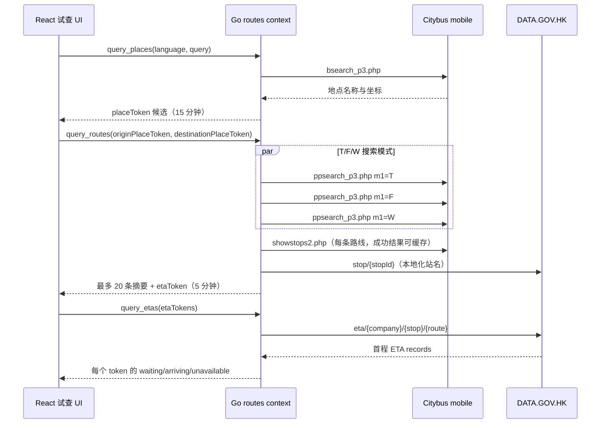

# Citybus 路线查询与首程 ETA

本文记录网站在线试查当前如何连接 Citybus mobile 与 DATA.GOV.HK，涵盖地点候选、路线聚合、P2P stop map、站名、首程 ETA、缓存、并发和降级。精确请求/响应 schema 与错误码以 `shared/contracts/openapi/route-query-api.openapi.yaml` 为准。

## 范围

网站只提供基础 Citybus route trial：

- 输入起点和终点关键字；
- 从服务端候选中选择地点；
- 查询最多 20 条 Citybus 路线摘要；
- 展示车费、耗时、步行距离、上下车站和首程 ETA。

网站不保存常用路线、不提供通知监测、多班 ETA、完整路线详情或跨交通工具出行规划；这些能力由 Android App 承担。

## 数据流



## 前端查询状态

`frontend/src/components/online-demo/OnlineQueryDemo.tsx` 负责交互状态：

- 地点输入停顿 300ms 后发起候选搜索。
- 自由文字不是有效地点；起终点都必须从当前候选列表选择。
- 起终点相同会在前端阻止提交，后端仍有独立校验。
- 地点、路线和 ETA 各自使用递增 request sequence；较旧响应到达后直接丢弃，不能覆盖最新输入或语言。
- 修改或交换地点会清空旧路线和 ETA。
- 已有同一组选择的成功结果时，语言切换会重新查询新语言；失败则保留上次成功路线，并明确提示刷新失败和旧结果仍在显示。
- 路线摘要成功后异步补充 ETA；ETA 整批失败只把 ETA 标记为不可用，不清空路线。

前端把后端 `error.code` 映射为三语用户文案，不展示后端 message、token 或第三方错误。

## 地点候选

### 外部请求

基础地址：`https://mobile.citybus.com.hk/nwp3/bsearch_p3.php`

服务端发送：

- `l`：`zh-Hant=0`、`en=1`、`zh-Hans=2`
- `q`：用户输入关键字
- `limit`：有效范围内的候选上限，当前默认/最大为 100
- `timestamp`：当前 Unix 毫秒
- `X-Requested-With: XMLHttpRequest`

HTTP timeout 为 10 秒。parser 跳过空行和无效经纬度；上游明确返回 `No Result` 时产生空候选，响应损坏或没有可解析行时属于外部/解析失败。

### Cache 与 token

- cache key：`language + query + limit`
- 成功候选 TTL：5 分钟
- cache 最大 1024 个 key；写入前清理过期项，达到上限时淘汰一个旧项
- 每个候选返回签名 `placeToken`，封装名称、经纬度、语言和 provider
- `placeToken` 有效期：15 分钟

浏览器只向路线接口提交 `placeToken`，不提交裸经纬度。token 只是短期防篡改载体，不是账号或身份凭证，也不能记录到普通日志。

## 路线聚合

### Citybus 请求

基础地址：`https://mobile.citybus.com.hk/nwp3/ppsearch_p3.php`

服务端对同一请求固定并发 T、F、W 三个 `m1` 模式，并发送：

- 起终点经纬度 `slat/slon/elat/elon`
- 香港时间 `t`
- `ws=1.3`
- `leg=2`
- 当前语言 `l`
- `Accept: */*`
- Citybus mobile `/nwp3/` Referer

单个 mode HTTP timeout 为 20 秒。某一 mode 超时、panic、非 2xx 或无法解析时会记录受控失败；其它 mode 仍可独立返回。只有三个 mode 都没有可解析路线时，整个路线查询失败。

`leg=2` 是当前网站生产参数，现有 fixture 和 parser 测试覆盖过包含两段的结果。但代码与契约没有证明该字段就是严格的“最多两段”上游语义，也没有验证 `leg=3/4`；因此不能把参数数字直接宣传成已支持的二、三或四段换乘能力。若要改变或解释该参数，必须比较 Citybus 的实际响应语义并补充回归证据。

### 解析、去重和排序

parser 从 Citybus HTML 中提取：

- 路线组合；
- HKD 总车费；
- 总耗时；
- 步行距离；
- `showroutep2p(...)` 的 `rawInfo`、list id 和 general info；
- 每一乘车段的 company、route variant、上下车 seq 和方向。

T/F/W 的结果按固定模式顺序收集，再按路线段、车费、耗时、步行和 `rawInfo` 去重。domain 最终按耗时等稳定规则排序，只返回前 20 条。

路线 cache key 使用 `language + 起终点坐标`，成功 TTL 为 1 分钟。cache 内不保存旧 `etaToken`；每次返回前根据当前请求重新签发。

### 进程级限流

当前 `RateLimiter` 为单进程内存结构，最多追踪 1024 个 key。composition root 以 operation 名称作为 key，地点、路线和 ETA 三类操作各自共享每分钟 120 次上限，而不是按用户、IP 或 visitor 独立计数。服务重启会清空该状态。

若未来改为网关、用户级或跨实例限流，必须同步 OpenAPI、错误语义、隐私说明和本文件，不能只替换 infrastructure 实现。

## P2P stop map 与站名

路线的 `rawInfo` 来自 Citybus P2P 结果，其中包含 route variant、上下车 seq 和方向，是 `showstops2.php` 对齐上下车 stop id 的基础。

服务端对每条可解析路线请求：

```text
https://mobile.citybus.com.hk/nwp3/showstops2.php?r=<rawInfo>&l=<language>
```

成功且非空的 stop map 按 `rawInfo + language` 缓存 24 小时；失败、空内容和解析失败不写成功 cache。每条路线失败时只缺失站点预览和该路线的 ETA stop id，不应清空其它路线。

站点展示名优先查询 DATA.GOV.HK `stop/{stopId}`：

| Locale | 字段优先级 |
| --- | --- |
| `zh-Hant` | `name_tc → name_en → name_sc` |
| `zh-Hans` | `name_sc → name_tc → name_en` |
| `en` | `name_en → name_tc → name_sc` |

成功短名按 `stopId + language` 缓存 24 小时。请求或字段失败时回退到 Citybus stop map 中的规范化站名；不因站名补齐失败隐藏路线、阻塞 ETA 或跨语言重试。

## 首程 ETA

### Token 与批量编排

只为具有首程 company、公开 route number、direction、boarding seq 和 stop id 的路线签发 `etaToken`。token 有效期 5 分钟，短于 `placeToken`，并包含当前路线首程查询所需上下文。

`query_etas`：

- 保持输入 token 数组顺序；
- 先按完整 token 去重；
- 同一 token 的重复位置复用一份结果；
- 最多同时执行 6 个外部 ETA 查询；
- 每个 goroutine 独立 recover；
- token 无效、过期、外部失败或 panic 都只让该项返回 `unavailable`。

因此 HTTP 批量成功表示服务已为每个输入生成受控状态，不代表每条路线都有实时 ETA。

### DATA.GOV.HK 匹配

外部地址：

```text
https://rt.data.gov.hk/v2/transport/citybus/eta/{company}/{stopId}/{route}
```

HTTP timeout 为 10 秒。候选记录先要求：

```text
route + stop + direction
```

如果存在与 P2P `boardingSeq` 相同的可解析记录，则只使用严格匹配；没有严格记录时，受控回退到同路线、同站、同方向的可解析记录。随后按有效 `eta_seq` 升序、ETA 时间升序选择首班。

该回退用于处理 Citybus P2P 站序与公开 ETA `seq` 偶发不一致，不能放宽 route、stop 或 direction，也不能用另一站或另一语言数据替代。

### 状态计算

- ETA 时间无法解析或没有匹配记录：`unavailable`
- 剩余时间大于 0：向上取整为 `waitMinutes`，状态为 `waiting`
- ETA 已到当前分钟或更早：`arriving`

前端将路线刚返回但 ETA 尚未完成的临时 `waiting` 显示为“查询中”；收到带分钟的状态后再显示等候时间。

## 错误与降级

| 失败点 | 当前行为 |
| --- | --- |
| 地点输入未选候选 | 前端 field error；不发路线请求 |
| 地点外部服务失败 | 候选清空并展示三语暂不可用 |
| `placeToken` 无效/过期 | 整次路线请求失败，要求重新选择 |
| T/F/W 部分失败 | 合并其它成功 mode |
| 三个 mode 均无可解析结果 | 路线查询失败 |
| stop map/站名失败 | 保留路线摘要，站点显示 fallback/不可用 |
| 单个 `etaToken` 失败 | 该项 `unavailable`，其它项不受影响 |
| `query_etas` 请求整体失败 | 前端保留路线并把所有 ETA 标为不可用 |
| 同一选择的语言刷新失败 | 保留上次成功路线并提示旧结果 |

不允许以 fixture、伪造数据、跨语言重试或旧成功结果冒充当前实时响应。保留旧结果时必须明确标识它是上次成功结果。

## Fixture 与第三方原文

`backend/internal/routes/infrastructure/citybus/testdata/route-query/` 中的三语 HTML fixture 用于 009 性能优化后的 parser 回归：

- 只对 Citybus `ppsearch_p3.php` 路线摘要做最小裁剪；
- 保留 `港元/至/預計/分鐘/步行距離/米`、对应简体以及 `Hong Kong Dollar/To/Estimated/Min/Walking distance/m` 等上游语义；
- 不改写成项目自定义格式；
- 上游真实格式变化时，先保存可复现最小样例并更新 fixture，再调整 parser；
- live 复现步骤见 `specs/009-route-query-performance/quickstart.md`，不提交完整第三方 HTML 或 Cookie。

Fixture 只能证明 parser 对保存样例的行为，不能替代真实 Citybus、DATA.GOV.HK、三语或网络失败验证。

## 日志与隐私

- 结构化日志可以记录 operationId、stage、language、duration、result count、cache hit、错误分类和受控 stop id。
- 路线结果日志不得记录起终点坐标、地点名、token、`rawInfo`、完整外部 URL、HTML 或第三方响应。
- 请求 body 和 query 内容不进入匿名 analytics 明细。
- 已知机器人不生成匿名统计事件；路线服务自己的受控运行日志仍按服务稳定性需要输出。

## 修改检查

修改 Citybus/ETA 链路时至少检查：

1. OpenAPI 与 `route-query-ui-state.md`；
2. 三语 `l` mapping 和动态字段回退；
3. token payload、TTL 和前端提交边界；
4. cache key、TTL、最大 key、进程重启语义；
5. timeout、T/F/W 或 ETA 并发、去重、顺序和 recover；
6. stop id、route variant、direction、boarding seq 和 `eta_seq` 匹配；
7. 部分失败是否保留仍可用结果；
8. 日志和 analytics 是否继续排除查询内容；
9. fixture、单元、race、Playwright 和真实三语验证各自完成情况。

常用验证：

```bash
cd backend
go test ./internal/routes/...
go test -race ./internal/routes/application ./internal/routes/infrastructure/memory

cd ../frontend
npm run test
npm run test:e2e -- online-query-demo.spec.ts
npm run openapi:routes:lint
npm run openapi:routes:bundle
```
