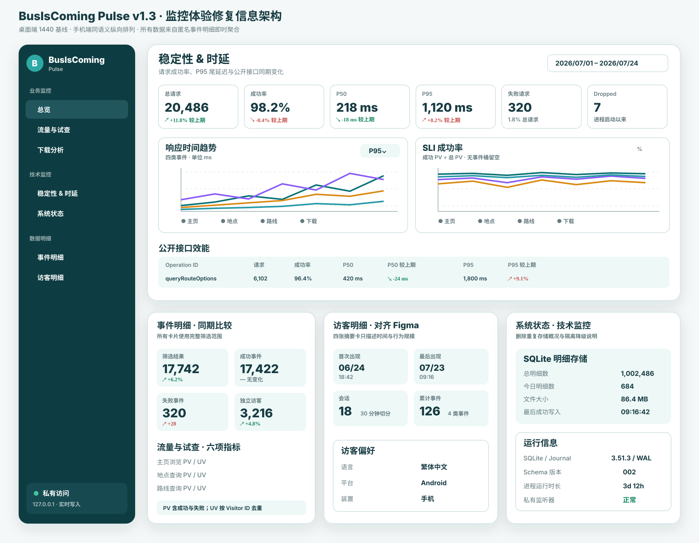

# UI 风格指南

本文定义 BusIsComing Website 跨页面长期遵循的视觉与交互原则。它不复制每个 feature 的精确页面合同；组件尺寸、状态和 Figma node 仍以对应 `specs/<feature>/` 与当前 CSS 为准。

## 体验定位

BusIsComing 应呈现为安静、实用、可信赖的现代通勤工具：让用户快速判断巴士路线规划与导航用途、试查路线、理解限制并下载 App，而不是制造夸张营销、复杂后台感或无意义装饰。

公开主页与私有 Pulse Dashboard 面向不同用户，但共享以下基线：

- 信息层级清楚，重要结论和主要操作容易扫描；
- 品牌识别稳定，不因页面或状态切换改变基本视觉语义；
- 状态变化保持布局稳定，加载、空、失败和部分成功都可理解；
- 电脑和手机都能完成同等核心任务；
- 键盘、触控、减弱动效和辅助技术从设计阶段开始考虑。

## 现有视觉基线

### 公开主页

当前公开主页以 feature 014 的 Figma Section `119:64` 为设计来源，并以固定 Chromium 下的
`1440×960`、`390×844`、`320px` Playwright golden 为实现基线。参考、实际图、叠图和差异图统一位于
`specs/014-upgrade-homepage-visual-system/visual-review/`，旧 FeatureGrid、四故事牌堆和 lightbox 只作历史记录。

### 私有监控

这些图片用于说明长期方向和已验证形态，不替代当前实现。若图片与当前页面、Figma 或测试冲突，先核对对应 feature 的版本和代码，再决定是否更新图片。

## 品牌与色彩

公开站的精确 token 位于 `frontend/src/styles/tokens.css`，Pulse token 位于 `frontend/src/monitoring/styles/tokens.css`。文档不复制每一个像素值，但以下语义必须保持：

- 深青绿色是主要品牌与行动色，用于主按钮、关键链接、选择和焦点关联状态。
- 白色或极浅背景承载主要内容，浅青灰用于次级 surface、分组和低强调状态。
- 正文使用高对比深色；说明和辅助信息使用仍可读的 muted 色，不以低对比制造“高级感”。
- 成功、警告、失败、信息和图表 series 使用不同语义色；不能只靠颜色区分结果。
- 阴影用于表达层级和浮层，不制造多层漂浮卡片或过重玻璃效果。

品牌 logo、favicon 和真实截图的来源与使用规则见[素材来源与维护](asset-provenance.md)。

## 信息层级

### 一个清楚的主要行动

每个视区或任务阶段应只有一个显著的 primary action。次级跳转、帮助和状态说明不能与下载、查询或确认操作争夺层级。

当 Android APK 处于检查中或不可用时，保持入口位置和结构稳定，但不能用看似可点击的视觉误导用户。状态恢复后再开放真实链接。

### 渐进披露

- 首屏优先产品身份、用途、可信素材和主要行动。
- 路线试查先要求选择有效地点，再展示路线与首程 ETA；不能一次暴露全部技术细节。
- 复杂筛选、图表解释和错误详情在 Dashboard 中按任务逐层展开。
- 帮助文字解释限制与下一步，不重复按钮名称或把内部错误直接暴露给用户。

### 稳定几何

loading、ready、empty、unavailable、partial error 和 success 应尽量共享容器尺寸和信息位置。不要因为文案或图标替换导致主要 section 大幅跳动；异步补齐站名或 ETA 时保留路线摘要。

## 布局与响应式

- 页面最小宽度基线为 320px；设计和验收的主要证据使用 390px 手机与 1440px 桌面。
- 内容宽度、页面边距和 section 间距由共享 token 与 `clamp()` 控制，不在组件内散落重复 magic number。
- 桌面布局可并排展示信息和视觉素材；手机布局允许重排和压缩，但不能删除语言、查询、下载、反馈或必要状态。
- 手机触控操作目标至少 44×44 CSS px；桌面键盘操作必须有可见 `:focus-visible`。
- 长繁体、简体和英文必须允许自然换行；不要通过固定高度或过早截断隐藏必要说明。
- 响应式改变的是布局，不改变行为契约和数据含义。

## 组件和状态

### 导航与语言

- 品牌入口、主要 section 导航、下载和语言切换需保持可发现。
- 语言标签使用“繁體中文／简体中文／English”或已有紧凑标签，并提供完整可访问名称。
- 语言切换应保留当前页面类型、query 和 hash，不把隐私页错误切回首页。

### 五故事截图舞台

- 只展示 manifest 中获批、可追踪衍生指纹的五张 v1.3.1 截图。
- 五张截图常驻环形槽位；一个前景、两个近景、两个远景形成明确远近关系，不排成平面队列。
- 故事只由 `01–05` 原生按钮切换，不自动播放、不拖拽、不提供 lightbox；Arrow/Home/End 与指针操作等价。
- 前景图片提供当前语言 alt；后景图片为空 alt、`aria-hidden`、不聚焦且不可点击。
- 手机边框四侧完整、无硬件开孔；故事轨在舞台下方的正常文档流内，不能覆盖截图。

### 表单与查询结果

- 地点自由文字只是搜索输入，必须从候选列表明确选择后才能查询路线。
- label、输入、候选、field error 和 form error 使用不同层级，不能只靠 placeholder 表达字段含义。
- 路线卡优先路线号/组合、车费、耗时、步行、上下车站和首程 ETA；缺少局部信息时保留可用内容。
- loading 和失败信息提供清楚下一步，不展示后端英文 message、token 或第三方原始错误。

### 下载入口

- `loading`、`ready`、`unavailable` 三态使用同一语义位置。
- 只有 `ready` 渲染可操作原生链接；其它状态不能带 `href` 或模拟下载。
- 不显示无法从浏览器可靠得知的伪下载进度或安装完成状态。
- ready 桌面端二维码与下载按钮解析到同一个公开绝对 URL；手机端不显示二维码。
- 下载段采用非卡片构图，进入视区后只运行一次克制的风带汇聚；reduced motion 完全静止。

### Dashboard 图表与表格

- 指标卡、图表和表格先表达问题和时间范围，再展示数值。
- 图表必须有可访问标题、说明或等价数据；tooltip 不能成为唯一信息来源。
- 手机端可把宽表转为卡片或分段列表，但字段、排序和分页含义必须保持。
- success、no data、no results、partial error、query failed、storage unavailable 等状态要有独立语义，禁止用示例数字填充真实空状态。

## 动效

- 动效只用于解释层级、连续性或直接操作反馈，时间短且可中断。
- 首页故事不自动切换；所有动效必须由用户选择或一次性进入视区触发。
- 风带只动画 `transform`、`opacity`、`scale`，周期约 10–22 秒，不驱动布局。
- 遵守 `prefers-reduced-motion: reduce`，关闭平滑滚动并把动画/过渡压缩到近乎即时。
- loading spinner 需要可访问文本，不能仅靠旋转图形表示状态。

## 无障碍

- 正文、按钮、状态和焦点具有足够对比度。
- 原生元素优先；自定义组合必须补齐名称、角色、状态、键盘和焦点恢复。
- 所有功能图片具有三语 alt；装饰图使用空 alt 或从辅助技术隐藏。
- 状态更新可被辅助技术感知，但高频 ETA、轮播或图表变化不能反复抢焦点。
- 错误与选择状态不能只靠颜色；图标应配合可见或屏幕阅读器文本。
- 电脑键盘、手机触控和常见缩放下都能完成查询、下载、切换语言与查看隐私说明。

## Figma 与实现关系

主要设计文件：

[BusIsComing Website - Homepage v1 Spec](https://www.figma.com/design/LAm6RjzFuFHsHFlcipx8pU/BusIsComing-Website---Homepage-v1-Spec)

关键长期索引：

| 范围 | 文档 |
| --- | --- |
| 首页体验和截图牌堆 | `specs/005-homepage-experience-polish/figma.md` |
| 首页 lightbox、功能网格和路线卡 | `specs/007-homepage-ui-polish/figma.md` |
| 隐私政策页 | `specs/008-privacy-policy-pages/spec.md` |
| 匿名统计 Dashboard | `specs/010-website-analytics/figma.md` |
| Dashboard 修复与可观测性 | `specs/011-analytics-dashboard-remediation/figma.md`、`specs/012-analytics-dashboard-observability/figma.md` |
| APK 双入口三态 | `specs/013-unify-apk-download/figma.md` |
| 首页五故事、路线、下载与收尾 | `specs/014-upgrade-homepage-visual-system/figma.md` |

涉及页面、组件、布局、视觉状态或交互的新 spec 必须在 plan/implement 前记录 Figma 文件、真实关键节点、手机/电脑 viewport、交互状态和版本。不得编造 node ID，也不能用本指南代替 feature 设计。

## 验收清单

每次 UI 变更至少检查：

1. 390px 与 1440px 的核心内容和主要操作完整可用；
2. 三语长文案无重叠、横向滚动或不可理解截断；
3. 键盘焦点顺序、visible focus 和浮层焦点恢复；
4. 44px 手机操作目标及缩放/大字体可读性；
5. loading、empty、error、partial、success 的布局和下一步；
6. `prefers-reduced-motion`；
7. 图片 alt、图表说明和不依赖颜色的状态；
8. Figma、自动化截图和当前实现是否指向同一版本。

自动化与截图只能证明覆盖过的浏览器和 viewport；真实设备、真实网络或辅助技术未验证时，必须明确保留风险。
