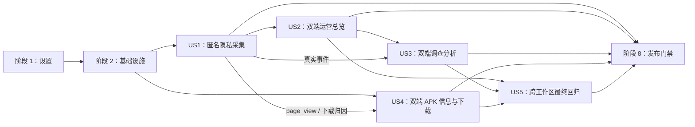

# 任务：网站匿名访问统计与监控面板

**输入**：`/specs/010-website-analytics/` 下的 `spec.md`、`plan.md`、`research.md`、
`data-model.md`、`figma.md`、`quickstart.md` 与 `contracts/`

**前置条件**：实施计划、数据模型、download/route-query/analytics-monitoring 三份 feature
OpenAPI、公开打点上下文契约和 Figma `BusIsComing Pulse v1.1 · 2026-07-22` 均已确定；01–10
已有导入锚点 `63:2118`，11–13 已由用户补充导入并提供真实锚点 `67:672`；子画板节点仍以
manifest、截图和后续可用的机器读取结果交叉核对，不推测未读取的节点 ID。

**测试策略**：本规格明确要求自动化测试。每个用户故事先编写并确认相关测试失败，再实现最小
代码使其通过；最终再执行 race、隐私 sentinel、100 万行性能、OpenAPI、Playwright、部署隔离和
静态构建门禁。

**组织方式**：任务按用户故事分组。`[P]` 仅表示任务修改不同文件且其前置契约已经稳定，可以并行
执行；`[USn]` 映射到 `spec.md` 中的同名用户故事。

## 阶段 1：设置（共享基础）

**目的**：锁定依赖、双前端构建入口、测试入口和共享契约，使后续实现有稳定边界。

- [X] T001 在 `backend/go.mod` 和 `backend/go.sum` 锁定经 runtime gate 验证、包含 SQLite WAL-reset 修复且支持 CGo-free 构建的 `modernc.org/sqlite` 版本
- [X] T002 [P] 在 `frontend/package.json` 和 `frontend/package-lock.json` 锁定与 React 18 兼容的 Recharts 3.x 及其必要 peer dependency，且不引入 React Router、TanStack Query 或 ORM
- [X] T003 [P] 建立私有 Dashboard 的独立 Vite 入口与 `dist-monitor` 构建配置，路径：`frontend/monitor/index.html`、`frontend/vite.monitor.config.ts`
- [X] T004 [P] 增加监控前端的 Vitest/Playwright/build 脚本与私有开发代理配置，路径：`frontend/package.json`、`frontend/playwright.monitor.config.ts`、`frontend/vitest.config.ts`
- [X] T005 将 download、route-query、analytics-monitoring 三份 feature OpenAPI 单向同步到 shared，兼容镜像只从 download shared 源生成或复制且不成为权威源，路径：`shared/contracts/openapi/download-api.openapi.yaml`、`shared/contracts/openapi/route-query-api.openapi.yaml`、`shared/contracts/openapi/analytics-monitoring-api.openapi.yaml`、`shared/contracts/download-api.openapi.yaml`
- [X] T006 以 feature route 契约为源同步有限 source header、`Set-Cookie` 和打点副作用到 shared，并用 schema diff 保证三个业务 body 不变，路径：`specs/010-website-analytics/contracts/route-query-api.openapi.yaml`、`shared/contracts/openapi/route-query-api.openapi.yaml`
- [X] T007 扩展 Redocly 命令，使三份 feature 与三份 shared 契约均可 lint/bundle，中文 API UI 不进入公网构建，路径：`frontend/package.json`、`frontend/redocly.yaml`

---

## 阶段 2：基础设施（阻塞前置）

**目的**：先建立 analytics DDD 边界、可替换端口、SQLite 明细存储、脱敏 HTTP 基础设施和双
listener 生命周期。此阶段完成前不开始用户故事实现。

### 基础测试与契约测试

- [X] T008 [P] 为四类事件、有限枚举、跨字段约束、UTC 毫秒和下载归因编写先失败的领域测试，路径：`backend/internal/analytics/domain/event_test.go`
- [X] T009 [P] 为 `ANALYTICS_WRITE_TIMEOUT_MS` 未配置、10/50/200、非法值 no-op、受控健康原因类别和可替换端口编写先失败测试，路径：`backend/cmd/server/config_test.go`、`backend/internal/analytics/application/record_event_test.go`、`backend/internal/analytics/application/runtime_health_test.go`
- [X] T010 [P] 为迁移幂等、目标索引、SQLite runtime 版本、每连接 WAL/`synchronous=NORMAL`/`busy_timeout` 和无汇总表编写先失败的集成测试，路径：`backend/internal/analytics/infrastructure/sqlite/store_test.go`、`backend/internal/analytics/infrastructure/sqlite/migrations_test.go`
- [X] T011 [P] 为不读取 ClientIP/实际 URI/query 的结构化请求日志、不回显 panic/request 的 recovery，以及 public/private handler panic 均返回受控 500 编写先失败测试，路径：`backend/internal/platform/httpserver/logger_test.go`、`backend/internal/platform/httpserver/recovery_test.go`、`backend/cmd/server/engine_middleware_test.go`
- [X] T012 [P] 为 public 启动致命、private 启动失败非致命、goroutine recover、错误传递和有界 shutdown 编写先失败测试，路径：`backend/internal/platform/httpserver/supervisor_test.go`、`backend/cmd/server/main_test.go`

### 基础实现

- [X] T013 实现与框架、SQL、文件系统及前端类型无关的 `AnalyticsEvent`、`DownloadAttribution`、值对象、有限枚举和领域错误，路径：`backend/internal/analytics/domain/event.go`、`backend/internal/analytics/domain/value_objects.go`、`backend/internal/analytics/domain/errors.go`
- [X] T014 [P] 定义筛选、游标、指标、序列、分布、访客、会话、漏斗和系统状态的领域数据结构，路径：`backend/internal/analytics/domain/query.go`、`backend/internal/analytics/domain/results.go`
- [X] T015 定义 `EventWriter`、`AnalyticsQueryStore`、clock、runtime health 和七类查询用例的应用端口与 DTO，路径：`backend/internal/analytics/application/ports.go`、`backend/internal/analytics/application/dto.go`
- [X] T016 实现 `RecordEvent` 基础编排、默认 50ms/闭区间 10–200ms 配置值注入、独立 deadline、单次写入、无重试的 no-op writer 和原子 `lastSuccessfulWriteAt`/`droppedSinceStart`，路径：`backend/internal/analytics/application/record_event.go`、`backend/internal/analytics/application/runtime_health.go`
- [X] T017 [P] 创建只包含 `analytics_events` 与技术迁移元数据、约束和计划索引的 additive migration，路径：`backend/internal/analytics/infrastructure/sqlite/migrations/001_create_analytics_events.sql`
- [X] T018 实现 `database/sql` SQLite 连接、runtime version gate、每连接 PRAGMA、幂等迁移和事件写入适配器，路径：`backend/internal/analytics/infrastructure/sqlite/store.go`、`backend/internal/analytics/infrastructure/sqlite/migrations.go`
- [X] T019 [P] 实现仅记录服务端 request ID、method、route template、operationId、bounded context、status、duration 和 body size 的脱敏 logger；机器人只产生相同通用日志且不含 bot 标记或身份线索，路径：`backend/internal/platform/httpserver/logger.go`
- [X] T020 [P] 实现不 dump request、不输出 panic 原值/受禁上下文且返回受控 500 的 Gin recovery，路径：`backend/internal/platform/httpserver/recovery.go`
- [X] T021 实现双 `http.Server` 的 recover 保护、状态上报、错误传递和有界关闭监督器，路径：`backend/internal/platform/httpserver/supervisor.go`
- [X] T022 建立 public/private engine factory 和配置校验；public 接收 `gin.HandlerFunc` analytics 参数并用无副作用 stub 验证 `logger → injected analytics → recovery → handler`，private 验证 `logger → recovery → handler`；同时实现默认 public `127.0.0.1:8080`、固定 private `127.0.0.1:18081` 绑定和非法 analytics 配置 no-op 降级，本任务不实现真实 tracking，路径：`backend/internal/platform/httpserver/engine.go`、`backend/internal/platform/httpserver/engine_test.go`、`backend/cmd/server/config.go`
- [X] T023 [P] 实现仅在 private engine 注册的监控静态资源 fallback 与 `Cache-Control: no-store`，路径：`backend/internal/analytics/interfaces/http/static_handler.go`

**检查点**：analytics 依赖方向为 `interfaces/infrastructure → application → domain`，public 与
private route tree 物理分离，存储失败不会阻塞公开业务。

---

## 阶段 3：用户故事 1 - 在不识别自然人的前提下统计访问（优先级：P1）生产硬门禁

**目标**：普通浏览器请求以签名 HttpOnly Cookie 形成匿名 UV，四个精确入口记录最小事件；已知
机器人、IP、完整网络标识和业务查询内容不进入统计明细，统计故障不改变公开响应。机器人只保留
不含 bot 标记或身份线索的通用脱敏请求日志，不产生专门机器人日志。

**独立测试**：使用 synthetic handlers 覆盖 metadata、地点、路线、下载和 ETA 路由，在无需
US4 真实 metadata 实现的情况下验证 Cookie、打点、bot 排除、通用日志边界、失败分类和
fail-open；再用 sentinel 扫描日志、SQLite/WAL/SHM 和私有响应。

### 用户故事 1 的测试与验证

- [X] T024 [P] [US1] 为 Cookie 首签、复用、篡改、过期、随机性、常量时间验证和全部 `__Host-` 属性编写先失败测试，路径：`backend/internal/analytics/infrastructure/signing/visitor_cookie_test.go`
- [X] T025 [P] [US1] 为已知机器人、真实 desktop/mobile/tablet 反例、粗设备/来源/locale 枚举、非法输入 fallback，以及机器人只有通用脱敏请求日志且无 bot 标记/专门日志编写先失败测试，路径：`backend/internal/analytics/infrastructure/classification/classifier_test.go`、`backend/internal/platform/httpserver/logger_test.go`
- [X] T026 [P] [US1] 为 request logger 先执行、bot-before-cookie、合法主页 header、Cookie 轮换、request-scoped 白名单和 analytics/recovery 顺序编写先失败测试，路径：`backend/internal/analytics/interfaces/http/tracking_middleware_test.go`
- [X] T027 [P] [US1] 为 metadata 成功/失败、地点与路线非法 JSON/限流/token/上游失败/panic/成功、下载成功/失败各一次以及 ETA 零事件编写先失败集成测试，路径：`backend/internal/analytics/interfaces/http/public_tracking_integration_test.go`
- [X] T028 [P] [US1] 为 SQLite 不可写、锁超时和阻塞 writer 编写先失败测试，验证 context deadline 不超过配置值与 200ms 上限、writer 只调用一次、丢弃计数恰好增加一次，且公开 status/header/JSON/APK bytes 与 no-op 基线等价，路径：`backend/internal/analytics/interfaces/http/fail_open_test.go`
- [X] T029 [P] [US1] 把 IP、完整 UA/Referrer/Cookie、URI/query/body、地点、坐标、token、客户端 requestId、panic 和上游响应 sentinel 注入请求并编写零命中测试，路径：`backend/internal/analytics/interfaces/http/privacy_sentinel_test.go`
- [X] T030 [P] [US1] 为浏览器端只输出 `direct/search/referral/internal/unknown` 且不发送原始 Referrer 编写先失败测试，路径：`frontend/src/services/analyticsSource.test.ts`
- [X] T031 [P] [US1] 为三语隐私事实、始终启用、无 DNT/GPC 退出、1 年 Cookie、长期明细和不记录 IP 编写先失败内容测试，路径：`frontend/src/tests/privacy-policy-analytics.test.tsx`

### 用户故事 1 的实现

- [X] T032 [US1] 实现 128-bit base64url visitor ID、版本化 HMAC-SHA256 签名、常量时间校验、过期与轮换，路径：`backend/internal/analytics/infrastructure/signing/visitor_cookie.go`
- [X] T033 [P] [US1] 实现只作瞬时判定且不持久化原始输入的 bot、device、source 和 locale 分类器，路径：`backend/internal/analytics/infrastructure/classification/classifier.go`
- [X] T034 [P] [US1] 实现仅允许 locale、failureCategory 和 download attribution 回填的 request-scoped 观察对象，路径：`backend/internal/analytics/interfaces/http/observation.go`
- [X] T035 [US1] 实现精确路由映射、bot-before-cookie、`__Host-bic-visitor` 签发及 recovery 外层的真实 tracking middleware；bot 排除后不追加事件或专门日志，路径：`backend/internal/analytics/interfaces/http/tracking_middleware.go`
- [X] T036 [US1] 把已校验 `ANALYTICS_WRITE_TIMEOUT_MS`、单次 fail-open recorder、内存健康状态与脱敏写入错误类别接入真实 middleware，路径：`backend/internal/analytics/interfaces/http/event_recorder.go`、`backend/internal/analytics/application/record_event.go`
- [X] T037 [US1] 只把 T035/T036 的真实 middleware 注入 T022 已存在的 public factory，并保证机器人只经过最外层通用脱敏 logger；不重建 engine、不再次替换 logger/recovery，路径：`backend/cmd/server/main.go`
- [X] T038 [US1] 在地点/路线 HTTP adapter 只回填受控 locale/failureCategory 并清除起终点、坐标、query、token 和客户端 requestId 日志，路径：`backend/internal/routes/interfaces/http/handler.go`、`backend/internal/routes/infrastructure/logging/logger.go`
- [X] T039 [US1] 在下载 HTTP adapter 提供平台与本次实际响应元数据的白名单回填钩子，失败时不借用配置版本，路径：`backend/internal/downloads/interfaces/http/handler.go`
- [X] T040 [P] [US1] 实现浏览器本地粗粒度来源分类，并在主页 metadata、地点和路线请求中只发送有限 header，路径：`frontend/src/services/analyticsSource.ts`、`frontend/src/services/routeQueryClient.ts`
- [X] T041 [P] [US1] 更新三语隐私政策，准确披露匿名标识、UV 含义、始终启用、长期保留、无备份及受禁字段，路径：`frontend/src/content/privacyPolicyContent.ts`
- [X] T042 [US1] 让 locale/noscript/SEO 生成内容与更新后的三语隐私事实一致，路径：`frontend/scripts/generate-locale-pages.mjs`、`frontend/src/content/seoPages.json`
- [X] T043 [US1] 运行 synthetic 路由、bot、通用日志边界、fail-open、隐私 sentinel 及 deadline 配置矩阵（unset/10/50/200 合法，9/201/0/负数/非整数 no-op）独立验收并记录命令与零命中预期，路径：`specs/010-website-analytics/quickstart.md`

**检查点**：US1 可通过 synthetic metadata route 独立验证；与真实 metadata 的 page-view 集成在
US4 完成。该故事完成前不得接入或交付真实 Dashboard 数据；统计故障、机器人请求和 ETA 均不
产生超出契约的副作用。

---

## 阶段 4：用户故事 2 - 查看网站运营总览（优先级：P1）首个可视化闭环

**目标**：在 US1 隐私硬门禁之后，维护者通过私有入口查看近 30 天核心指标、PV/UV 趋势、上一
周期、两个有序漏斗、事件构成、响应时间和下载分布；桌面与手机总览在同一故事内完成，并在
成功加载后每 60 秒刷新。

**独立测试**：向临时 SQLite 写入固定四类事件 fixture，在 1440×1200 与 390×844 分别打开私有
总览，逐项比对人工结果并验证主要筛选可达；加载、无数据、筛选无结果、普通失败和数据库不可用
状态均可单独注入。

### 用户故事 2 的测试与验证

- [x] T044 [P] [US2] 为正好 30 分钟仍同会话、超过 30 分钟分会话、范围前置事件、两个顺序漏斗、上一等长周期、缺失桶和 nearest-rank P50/P95 编写先失败测试，路径：`backend/internal/analytics/domain/aggregation_test.go`
- [x] T045 [P] [US2] 为 PV、UV、人均访问、成功路线试查、下载请求、请求成功率及平台/版本筛选作用域编写先失败应用测试，路径：`backend/internal/analytics/application/query_overview_test.go`
- [x] T046 [P] [US2] 为近 30 天总览、香港时区 hour/day/week/month 分桶和 `ready/no_data/no_results` 编写先失败 SQLite fixture 测试，路径：`backend/internal/analytics/infrastructure/sqlite/query_overview_test.go`
- [x] T047 [P] [US2] 按私有 OpenAPI 为总览筛选校验、统一 envelope、`no-store`、500 和 503 编写先失败 HTTP 契约测试，路径：`backend/internal/analytics/interfaces/http/overview_handler_test.go`
- [x] T048 [P] [US2] 为筛选序列化、上一周期响应和错误映射编写先失败前端 client 测试，路径：`frontend/src/monitoring/services/analyticsClient.test.ts`
- [x] T049 [P] [US2] 为全套 KPI/图表/漏斗、五类页面状态、更新时间、成功后 60 秒不重叠刷新及 1440/390 核心操作编写先失败组件测试，路径：`frontend/src/monitoring/pages/OverviewPage.test.tsx`
- [x] T050 [US2] 以固定 mock 响应定义 1440×1200 与 390×844 总览交互和截图断言，并先确认测试失败，路径：`frontend/playwright-monitor/overview.spec.ts`、`frontend/playwright-monitor/fixtures/analytics.ts`

### 用户故事 2 的实现

- [x] T051 [US2] 实现带中文规则注释的 30 分钟会话、范围边界、有序漏斗、上一周期、缺失桶和 nearest-rank 分位值领域服务，路径：`backend/internal/analytics/domain/aggregation.go`
- [x] T052 [US2] 实现总览应用用例并保证平台/版本筛选只影响下载相关指标与漏斗终点，路径：`backend/internal/analytics/application/query_overview.go`
- [x] T053 [US2] 实现共享时间范围、香港时区分桶、筛选和 opaque cursor SQL 构建器，路径：`backend/internal/analytics/infrastructure/sqlite/query_builder.go`
- [x] T054 [US2] 实现从明细即时计算总览、比较周期、漏斗、分位值和分布的 SQLite 查询适配，路径：`backend/internal/analytics/infrastructure/sqlite/query_overview.go`
- [x] T055 [US2] 实现 OpenAPI 约束的筛选解析、错误映射和 `GET /api/analytics/overview` handler，路径：`backend/internal/analytics/interfaces/http/query_parser.go`、`backend/internal/analytics/interfaces/http/overview_handler.go`
- [x] T056 [US2] 只在 private engine 注册总览 API 和监控 SPA，路径：`backend/internal/analytics/interfaces/http/private_routes.go`、`backend/cmd/server/main.go`
- [x] T057 [P] [US2] 实现监控 OpenAPI 对应 TypeScript DTO、统一 client、筛选与日期范围序列化，路径：`frontend/src/monitoring/services/analyticsTypes.ts`、`frontend/src/monitoring/services/analyticsClient.ts`
- [x] T058 [P] [US2] 实现无 React Router 依赖的 hash 导航、近 30 天默认范围、粒度/比较/多维筛选状态，并首次建立 `MonitoringI18nProvider`、浏览器语言选择、繁中 fallback、持久化语言选择、语言切换器以及总览和共享 shell/filter/state 三语 copy，路径：`frontend/src/monitoring/app/hashRoute.ts`、`frontend/src/monitoring/app/FilterProvider.tsx`、`frontend/src/monitoring/app/MonitoringI18nProvider.tsx`、`frontend/src/monitoring/components/layout/MonitoringLanguageSwitcher.tsx`、`frontend/src/monitoring/content/copy.ts`
- [x] T059 [P] [US2] 按 Figma tokens 建立监控色彩、字体、间距、卡片、焦点和桌面/手机网格样式，路径：`frontend/src/monitoring/styles/tokens.css`、`frontend/src/monitoring/styles/dashboard.css`
- [x] T060 [P] [US2] 实现桌面 Dashboard shell、侧栏、顶栏、语言切换器、全局筛选和更新时间组件，并保持切换语言时当前 hash 与筛选不变，路径：`frontend/src/monitoring/components/layout/DashboardShell.tsx`、`frontend/src/monitoring/components/layout/MonitoringLanguageSwitcher.tsx`、`frontend/src/monitoring/components/filters/GlobalFilters.tsx`
- [x] T061 [P] [US2] 实现具备文字摘要的指标卡、PV/UV 折线、事件/平台/版本分布、响应时间和双漏斗组件，路径：`frontend/src/monitoring/components/charts/MetricCard.tsx`、`frontend/src/monitoring/components/charts/TrafficChart.tsx`、`frontend/src/monitoring/components/charts/DistributionChart.tsx`、`frontend/src/monitoring/components/charts/FunnelChart.tsx`
- [x] T062 [US2] 实现总览数据装配、五类状态、筛选回显、总览及共享状态三语文案和仅成功加载后 60 秒自动刷新，路径：`frontend/src/monitoring/pages/OverviewPage.tsx`、`frontend/src/monitoring/components/states/QueryState.tsx`、`frontend/src/monitoring/content/copy.ts`
- [x] T063 [US2] 接通私有 React 入口，路径：`frontend/src/monitoring/main.tsx`、`frontend/src/monitoring/app/MonitoringApp.tsx`
- [x] T064 [US2] 在 `<=820px` 实现移动抽屉/底部导航、两列 KPI、纵向卡片和紧凑筛选，并保存与 Figma 节点 `63:2118` 对照的桌面/手机总览证据，路径：`frontend/src/monitoring/components/layout/DashboardShell.tsx`、`frontend/src/monitoring/styles/responsive.css`、`frontend/playwright-monitor/__screenshots__/overview-desktop.png`、`frontend/playwright-monitor/__screenshots__/overview-mobile.png`

**检查点**：US1 隐私硬门禁和 US2 双端总览均完成后，形成第一个可发布可视化闭环；fixture 只用于
测试，不能绕过 US1 接入生产数据。

---

## 阶段 5：用户故事 3 - 调查事件、访客路径和异常（优先级：P2）

**目标**：维护者可从流量、下载、事件、访客、失败与性能、系统状态深入调查，使用稳定游标和
完整 visitor header 精确定位，同时不获得任何受禁数据或写操作。

**独立测试**：向临时存储写入固定事件，直接调用六类详细查询及私有 handler，验证游标无重漏、
完整 visitor 只从 header 精确匹配、详细页面不会自动刷新、DB 不可用时 system 仍解释状态；再以
1440px 桌面和 390px 手机分别完成“总览异常 → 事件筛选 → visitor 时间线”调查流程。

### 用户故事 3 的测试与验证

- [X] T065 [P] [US3] 为事件 keyset 游标、同毫秒稳定顺序、访客精确匹配、范围前置会话和默认 50/最大 100 编写先失败应用测试，路径：`backend/internal/analytics/application/query_details_test.go`
- [X] T066 [P] [US3] 为流量热力图、试查漏斗、下载版本/平台/失败分布编写先失败 SQLite 测试，路径：`backend/internal/analytics/infrastructure/sqlite/query_traffic_downloads_test.go`
- [X] T067 [P] [US3] 为事件无重复无遗漏分页、截断 ID 列表、访客摘要/时间线和 30 分钟正边界编写先失败 SQLite 测试，路径：`backend/internal/analytics/infrastructure/sqlite/query_events_visitor_test.go`
- [X] T068 [P] [US3] 为 endpoint 成功率/P50/P95、受控失败分类、DB 状态和 DB 不可用 system=200/其他=503 编写先失败测试，路径：`backend/internal/analytics/infrastructure/sqlite/query_performance_system_test.go`
- [X] T069 [P] [US3] 按 OpenAPI 为剩余六个只读 operation、visitor header、cursor 400、404、500、503 和 `no-store` 编写先失败契约测试，路径：`backend/internal/analytics/interfaces/http/private_handlers_test.go`
- [X] T070 [P] [US3] 为事件分页、完整 visitor header、复制反馈和错误 envelope 映射编写先失败前端测试，路径：`frontend/src/monitoring/services/analyticsDetailsClient.test.ts`、`frontend/src/monitoring/pages/EventsPage.test.tsx`
- [X] T071 [P] [US3] 为流量、下载、访客、性能、系统页面的数据形态与 fake timer 下不自动刷新编写先失败组件测试，路径：`frontend/src/monitoring/pages/DetailPages.test.tsx`
- [X] T072 [US3] 对照 `11 Pulse / Mobile Investigation / 390` 为 1440px 桌面和 390px 手机定义“总览异常 → 事件筛选 → visitor 时间线”两分钟调查流程并先确认 E2E 失败，路径：`frontend/playwright-monitor/investigation.spec.ts`

### 用户故事 3 的实现

- [X] T073 [US3] 实现 traffic/downloads/events/visitor/performance/system 查询编排、游标校验和存储错误映射，路径：`backend/internal/analytics/application/query_details.go`
- [X] T074 [P] [US3] 实现流量趋势/热力图/分类、试查漏斗和下载趋势/版本/平台/失败即时查询，路径：`backend/internal/analytics/infrastructure/sqlite/query_traffic_downloads.go`
- [X] T075 [P] [US3] 实现 `(occurred_at_ms,id)` keyset 分页、visitor 摘要、范围前置事件和会话时间线查询，路径：`backend/internal/analytics/infrastructure/sqlite/query_events_visitor.go`
- [X] T076 [P] [US3] 实现 endpoint 性能、nearest-rank P50/P95、失败分类和不泄露 DB 路径的系统健康查询，路径：`backend/internal/analytics/infrastructure/sqlite/query_performance_system.go`
- [X] T077 [US3] 实现并仅在 private engine 注册 traffic/downloads/events/visitor/performance/system handlers，路径：`backend/internal/analytics/interfaces/http/detail_handlers.go`、`backend/internal/analytics/interfaces/http/private_routes.go`
- [X] T078 [P] [US3] 首次实现六个详细工作区的 `zh-Hant`、`zh-Hans`、`en` 文案与格式化类型，以及可访问热力图、时间序列、环形/柱状图、keyset 分页表和会话时间线组件，路径：`frontend/src/monitoring/components/charts/Heatmap.tsx`、`frontend/src/monitoring/components/tables/EventTable.tsx`、`frontend/src/monitoring/components/timeline/VisitorTimeline.tsx`、`frontend/src/monitoring/content/copy.ts`、`frontend/src/monitoring/content/types.ts`
- [X] T079 [P] [US3] 实现流量与试查、下载分析页面及筛选回显，路径：`frontend/src/monitoring/pages/TrafficPage.tsx`、`frontend/src/monitoring/pages/DownloadsPage.tsx`
- [X] T080 [P] [US3] 实现默认截断 visitor、游标分页且无导出/删除/编辑入口的事件明细页，路径：`frontend/src/monitoring/pages/EventsPage.tsx`
- [X] T081 [P] [US3] 实现只用 `X-Analytics-Visitor-ID` 精确查询、复制完整 ID 及按会话分组时间线的访客页，路径：`frontend/src/monitoring/pages/VisitorPage.tsx`
- [X] T082 [P] [US3] 实现失败与性能页及 DB/写入丢弃/private listener 系统状态页，路径：`frontend/src/monitoring/pages/PerformancePage.tsx`、`frontend/src/monitoring/pages/SystemPage.tsx`
- [X] T083 [US3] 接通六个详细 hash workspace、手动刷新和不自动跳动语义，并完成桌面/手机两分钟调查 E2E，路径：`frontend/src/monitoring/app/MonitoringApp.tsx`、`frontend/playwright-monitor/investigation.spec.ts`
- [X] T084 [US3] 对照 `11 Pulse / Mobile Investigation / 390` 在 `<=820px` 实现紧凑筛选、key-value 事件/性能卡片、精确 visitor 搜索与复制反馈、纵向时间线和可达分页，并保存详细页桌面/手机证据，路径：`frontend/src/monitoring/styles/mobile-components.css`、`frontend/src/monitoring/components/tables/ResponsiveEventList.tsx`、`frontend/playwright-monitor/__screenshots__/investigation-desktop.png`、`frontend/playwright-monitor/__screenshots__/investigation-mobile.png`

**检查点**：US3 可用 fixture 独立调查；生产数据依赖 US1 采集，页面 shell 依赖 US2，但查询和
UI 不依赖公开 handler 内部模型，且本故事自身已完成桌面与手机实现。

---

## 阶段 6：用户故事 4 - 查看 APK 信息并可靠下载（优先级：P2）

**目标**：主页展示当前 Android APK 版本和本地化大小；metadata 失败时明确不可用且不重试、
不回退旧值、不阻断稳定下载，并为主页访问与实际下载结果提供准确打点。

**独立测试**：使用临时 manifest/APK 分别验证 metadata 成功、缺失、非法、不可读和下载成功/
失败；前端分别以 1440px 桌面和 390px 手机验证 metadata 成功/失败时稳定下载 URL 始终可达。

### 用户故事 4 的测试与验证

- [X] T085 [P] [US4] 为白名单 `LatestApkMetadata`、manifest 错误映射和不暴露路径/SHA-256 编写先失败应用测试，路径：`backend/internal/downloads/application/get_latest_apk_metadata_test.go`
- [X] T086 [P] [US4] 为 metadata manifest 读取、basename、版本/大小/日期校验及不读取 APK bytes 的只读仓储方法编写先失败测试，路径：`backend/internal/downloads/infrastructure/filesystem/metadata_repository_test.go`
- [X] T087 [P] [US4] 按公开 OpenAPI 为 metadata 200/4xx/5xx、`no-store`、稳定下载 URL 和现有下载语义编写先失败 handler 测试，路径：`backend/internal/downloads/interfaces/http/metadata_handler_test.go`
- [X] T088 [P] [US4] 为精确主页单次请求、StrictMode/in-flight 去重、语言切换不重取、Intl 大小，以及失败时无自动/手动重试和无旧值回退编写先失败前端测试，路径：`frontend/src/tests/download-metadata-provider.test.tsx`
- [X] T089 [US4] 对照 `12 Homepage / Mobile APK Metadata States / 390` 为三语主页 metadata 成功/失败且下载始终可达定义 1440px 桌面和 390px 手机先失败浏览器测试，路径：`frontend/playwright/apk-metadata.spec.ts`

### 用户故事 4 的实现

- [X] T090 [US4] 定义只读 metadata repository 端口、白名单 DTO、用例和受控错误映射，路径：`backend/internal/downloads/application/ports.go`、`backend/internal/downloads/application/get_latest_apk_metadata.go`
- [X] T091 [US4] 实现仅从当前 manifest 读取/校验元数据且不加载 APK bytes 的文件适配器，路径：`backend/internal/downloads/infrastructure/filesystem/artifact_repository.go`
- [X] T092 [US4] 实现并注册 `GET /api/downloads/android/latest/metadata`、中文安全错误和 `Cache-Control: no-store`，路径：`backend/internal/downloads/interfaces/http/metadata_handler.go`、`backend/internal/downloads/interfaces/http/routes.go`
- [X] T093 [US4] 将真实 metadata 的合法主页 header 与成功/失败 page-view、真实下载成功版本/代码/大小接入 analytics 观察对象，路径：`backend/internal/downloads/interfaces/http/metadata_handler.go`、`backend/internal/downloads/interfaces/http/handler.go`
- [X] T094 [P] [US4] 实现不缓存陈旧结果、不重试且只发送有限主页 locale/source header 的 metadata client，路径：`frontend/src/services/downloadMetadataClient.ts`
- [X] T095 [US4] 实现单 document 共享 in-flight 状态、Intl 格式化和 `ready/unavailable` 的 provider，路径：`frontend/src/components/download/DownloadMetadataProvider.tsx`
- [X] T096 [US4] 仅在 `/zh-hant/`、`/zh-hans/`、`/en/` 精确主页挂载 provider，隐私页和未知路径不请求，路径：`frontend/src/app/App.tsx`
- [X] T097 [US4] 从静态 manifest 文案移除版本/大小旧值并在 Hero/下载区首次实现三语当前值或暂不可用文案，同时保持稳定下载链接，路径：`frontend/src/content/downloadManifest.ts`、`frontend/src/content/homepageContent.ts`、`frontend/src/components/hero/HeroIntro.tsx`、`frontend/src/components/sections/DownloadSection.tsx`
- [X] T098 [US4] 完成 metadata 成功/失败的桌面/手机浏览器验收，并保存与 `10 Homepage / APK Metadata States / 1200`、`12 Homepage / Mobile APK Metadata States / 390` 对照的双端视觉证据，路径：`frontend/playwright/apk-metadata.spec.ts`、`frontend/playwright/__screenshots__/apk-metadata-desktop.png`、`frontend/playwright/__screenshots__/apk-metadata-mobile.png`

**检查点**：US4 在 no-op analytics 下仍能独立提供 metadata 和下载；与 US1 组合后才产生真实
`page_view` 和完整下载归因，且本故事自身已完成主页相关状态的桌面与手机实现。

---

## 阶段 7：用户故事 5 - 验证监控页面的双端三语一致性（优先级：P3）

**目标**：在 US2、US3、US4 已分别完成桌面与手机实现的基础上，对七个工作区、筛选、状态和
主要调查操作执行跨工作区三语、可访问性与视觉回归，确认整体遵循 Figma。

**独立测试**：所有数据使用固定 mock；分别以 1440×1200、390×844 和 390×1640 跑三语导航、
筛选、图表摘要、表格移动转译、四类状态和截图对比，不依赖真实数据库。

### 用户故事 5 的测试与验证

- [ ] T099 [P] [US5] 为 Dashboard 导航、指标、筛选、图例、tooltip、表格、状态和错误的三语 key 完整性及隐私事实一致性编写先失败测试，路径：`frontend/src/monitoring/content/copy.test.ts`
- [ ] T100 [P] [US5] 为焦点顺序、44px 触摸目标、非颜色唯一信息、图表文字摘要、`aria-live` 复制反馈和 reduced-motion 编写先失败测试，路径：`frontend/src/monitoring/components/accessibility.test.tsx`
- [ ] T101 [P] [US5] 为七个 workspace 在 1440×1200 与 390×844 的三语导航、筛选和主要操作编写跨工作区先失败 E2E，路径：`frontend/playwright-monitor/responsive-locales.spec.ts`
- [ ] T102 [US5] 对照 `13 Pulse / Query Failure State / 1440` 为 loading、no_data、no_results、保留筛选且手动重试的普通失败和 DB unavailable 的 390×1640/1440×1000 视觉基准编写先失败测试，路径：`frontend/playwright-monitor/states.spec.ts`

### 用户故事 5 的回归与收口

- [ ] T103 [US5] 运行七个工作区三语 key/格式化类型完整性和隐私事实一致性回归，禁止在本任务首次建立 provider 或批量补齐所属故事文案，路径：`frontend/src/monitoring/content/copy.test.ts`、`frontend/src/monitoring/content/types.ts`
- [ ] T104 [US5] 验证浏览器默认语言、繁中 fallback、持久化切换以及切换后 hash/筛选/调查上下文保持，不重复实现语言基础设施，路径：`frontend/src/monitoring/app/MonitoringI18nProvider.test.tsx`、`frontend/playwright-monitor/responsive-locales.spec.ts`
- [ ] T105 [US5] 为图表/表格补充文字摘要、键盘焦点、ARIA、44px 触摸目标、非颜色编码和 reduced-motion，路径：`frontend/src/monitoring/components/charts/AccessibleChartFrame.tsx`、`frontend/src/monitoring/styles/accessibility.css`
- [ ] T106 [US5] 完成香港繁中、自然克制英文和三语隐私/指标口径独立审校并记录非机械直译结论，路径：`specs/010-website-analytics/zh-hant-en-copy-review.md`
- [ ] T107 [US5] 生成七个 workspace 与五类状态的桌面/手机三语截图证据，路径：`frontend/playwright-monitor/__screenshots__/`、`frontend/playwright-monitor/responsive-locales.spec.ts`、`frontend/playwright-monitor/states.spec.ts`
- [ ] T108 [US5] 对照 Figma 01–10 锚点 `63:2118`、11–13 补充导入锚点 `67:672`、`BusIsComing Pulse v1.1` 的 13 张 manifest 画板和 tokens，记录已实现 viewport/交互/状态差异；不得为锚点下未机器读取的子画板虚构节点 ID，路径：`specs/010-website-analytics/figma.md`

**检查点**：US5 只做跨工作区最终回归，不承担首次移动端实现；七个 workspace 与全部状态在
电脑、手机和三语下可独立使用，UI 评审有真实截图与 Figma 追溯证据。

---

## 阶段 8：打磨与跨切面门禁

**目的**：完成契约、性能、部署、隐私、架构、范围和全链路验证，使所有故事可共同发布。

- [ ] T109 [P] 运行三份 feature/三份 shared OpenAPI lint 与 bundle，生成项目可控内容为中文的 API UI，并确认私有 HTML 不进入 `frontend/dist`，路径：`shared/contracts/openapi/download-api.bundle.yaml`、`shared/contracts/openapi/route-query-api.bundle.yaml`、`shared/contracts/openapi/analytics-monitoring-api.bundle.yaml`、`shared/contracts/openapi/docs/`
- [ ] T110 [P] 编写显式 1,000,000 行、四类事件、多维度、成功/失败性能 fixture 与 `EXPLAIN QUERY PLAN` 断言，路径：`backend/internal/analytics/infrastructure/sqlite/performance_test.go`
- [ ] T111 根据 T110 证据调整必要索引并保证近 30 天常用查询和单 visitor 时间线各小于 1 秒，且不增加汇总/会话/访客表，路径：`backend/internal/analytics/infrastructure/sqlite/migrations/001_create_analytics_events.sql`、`backend/internal/analytics/infrastructure/sqlite/query_builder.go`
- [ ] T112 [P] 先扩展发布 shell 测试，覆盖双 bundle checksum、shared analytics 权限、env 补缺不覆盖、精确 `ReadWritePaths`、loopback、Caddy 无私有路由/日志和统计失败 degraded，路径：`scripts/tests/deploy_test.sh`
- [ ] T113 更新本地发布打包流程以构建并校验 `frontend/dist`、`frontend/dist-monitor` 和 CGo-free 静态后端，路径：`scripts/deploy.sh`
- [ ] T114 更新远端发布以创建 `/opt/busiscoming/shared/analytics`、注入独立 secret/DB/UI/port、保护 SQLite/WAL/SHM 跨 release/rollback/cleanup 并保持私有失败非致命，路径：`scripts/deploy-remote.sh`
- [ ] T115 记录 SSH 隧道、固定 loopback、systemd 权限、Caddy/UFW 隔离、无备份/恢复点和数据可丢失运维语义，路径：`docs/deployment.md`
- [ ] T116 [P] 增加 public 8080 不存在监控 HTML/API、private 18081 包含七 API、private 启动失败不退出 public，以及 private handler panic 返回受控 500 且 public 仍存活的进程级集成测试，路径：`backend/cmd/server/private_listener_integration_test.go`
- [ ] T117 运行后端全量、race、CGo-free Linux amd64 静态构建和 SQLite runtime/migration 测试并记录预期，路径：`specs/010-website-analytics/quickstart.md`
- [ ] T118 [P] 运行前端全量 Vitest、public/monitor build、public/monitor Playwright 并断言 `dist` 与 `dist-monitor` 物理隔离，路径：`frontend/package.json`、`frontend/playwright.config.ts`、`frontend/playwright.monitor.config.ts`
- [ ] T119 运行受禁字段 sentinel 扫描日志、SQLite、WAL/SHM 和私有响应，确认 IP、完整标识原文和查询内容零命中，路径：`backend/internal/analytics/interfaces/http/privacy_sentinel_test.go`、`specs/010-website-analytics/quickstart.md`
- [ ] T120 审计 DDD 依赖方向、无业务 `panic`、T022 public factory 的 `logger → injected analytics stub → recovery → handler`、T037 真实 tracking 注入后的同序链路、private `logger → recovery → handler`、双引擎 handler panic、自建 goroutine recover、脱敏日志，以及机器人只有不带 bot/身份线索的通用请求日志，路径：`backend/internal/analytics/`、`backend/internal/platform/httpserver/`、`backend/cmd/server/`
- [ ] T121 验证仅有四类事件且 ETA/隐私页/静态页不打点，并确认无账号、指纹、广告、安装完成、导出、删除、编辑、自动清理、备份、完整路线规划或非香港巴士能力，路径：`backend/internal/analytics/domain/event_test.go`、`frontend/src/monitoring/pages/EventsPage.test.tsx`、`specs/010-website-analytics/spec.md`
- [ ] T122 对照 Figma `BusIsComing Pulse v1.1 · 2026-07-22`、两批真实导入锚点 `63:2118`/`67:672`、13 张 manifest 画板和真实桌面/手机截图完成最终视觉评审，路径：`specs/010-website-analytics/figma.md`、`docs/superpowers/prototypes/2026-07-20-analytics-dashboard-figma-import/manifest.json`、`frontend/playwright-monitor/__screenshots__/`
- [ ] T123 执行 OpenAPI、Go/race、隐私、100 万行、双 listener、前端、三语、Figma、部署和公网隔离全套验收，并在文档中记录实际命令与结果，路径：`specs/010-website-analytics/quickstart.md`

---

## 依赖与执行顺序

### 阶段依赖

- **阶段 1 设置**：无依赖，可立即开始。
- **阶段 2 基础设施**：依赖阶段 1，阻塞所有用户故事。
- **US1（阶段 3）**：依赖阶段 2；匿名采集与隐私 sentinel 是接入任何真实流量的生产硬门禁。
- **US2（阶段 4）**：依赖 US1 才可接入生产；可预先用确定性 fixture 测试，但不得作为可发布 MVP，且本故事内同时交付桌面与手机总览。
- **US3（阶段 5）**：依赖 US1 和 US2；查询可用 fixture 独立验证，生产调查价值依赖 US1 产生事件，前端 shell 复用 US2，并在本故事内完成桌面与手机详细页。
- **US4（阶段 6）**：metadata/download 可在阶段 2 后以 no-op analytics 独立工作，真实 page-view 与下载归因集成依赖 US1；本故事内同时验证桌面与手机主页状态。
- **US5（阶段 7）**：依赖 US2、US3 和 US4 已分别完成双端页面；只执行跨工作区三语、可访问性和视觉回归，不承担首次移动端实现。
- **阶段 8 打磨**：依赖目标用户故事完成，跨切面门禁全部通过后才可发布。

### 单个用户故事内部顺序

- 先编写该故事列出的测试并确认因能力缺失而失败，再按领域 → 应用 → 基础设施/接口适配 →
  前端 → 独立验收的顺序实现。
- OpenAPI 与跨切面契约先于 handler；领域层不得引用 Gin、SQL、文件系统、加密适配或前端类型。
- analytics middleware 必须位于自有 recovery 外层；bot 判断必须先于 Cookie 验证/签发和事件写入。
- public engine 必须按 `logger → analytics → recovery → handler` 装配，private engine 必须按
  `logger → recovery → handler` 装配，并分别用 handler panic 集成测试验证受控 500 与进程存活。
- 所有统计写入均短超时、无重试、fail-open；本功能不新增队列、定时聚合、checkpoint、清理或备份
  goroutine。
- UI 实现以 `specs/010-website-analytics/figma.md`、导入 manifest/tokens 和真实截图为准，不从原型
  样例数值生成生产事实，也不虚构 Figma 子节点。
- 每个涉及 UI 的用户故事都必须在自身检查点前完成 1440px 桌面与 390px 手机实现和验收；US5
  只负责跨故事最终回归。

## 并行机会示例

### US1

- T024、T025、T026、T027、T028、T029 可分别推进 Cookie、机器人分类、隐私 sentinel、来源 header 和文案测试。
- T032、T033、T034、T040、T041 修改不同层级文件，可在各自先失败测试完成后并行。

### US2

- T044、T045、T046、T047、T048、T049 可在数据结构与 OpenAPI 稳定后并行编写。
- T057、T059、T060、T061 修改不同前端文件，可在 T055 的响应契约稳定后并行。

### US3

- T066、T067、T068 可并行覆盖三组 SQLite 查询；T074、T075、T076 在共享 query builder 稳定后并行。
- T079、T080、T081、T082 可由不同实现者并行，最后由 T083 接入统一 shell、T084 完成手机详细页验收。

### US4

- T085、T086、T087、T088 可并行编写后端各层与前端 provider 测试。
- T094 可与 T090–T093 并行，T095–T098 在 client 和 handler 契约稳定后串行接入并完成双端验收。

### US5

- T099、T100、T101 可并行定义三语、可访问性和跨工作区响应式门禁。
- T103、T104、T105 分别执行三语事实、语言状态保持和可访问性回归；不得在 US5 首次建立 i18n 基础设施，最后由 T107 统一生成视觉证据。

## 实施策略

### 可发布 MVP

1. 完成阶段 1 和阶段 2。
2. 完成 US1，先以隐私 sentinel、机器人排除、fail-open 和真实入口集成形成匿名采集生产硬门禁。
3. 完成 US2，在 1440px 桌面和 390px 手机上核对三语 provider/切换、指标、漏斗、上一周期、状态、60 秒刷新和 Figma 视觉。

只有 US1 + US2 才构成首个可发布可视化闭环。US2 可提前使用确定性 SQLite fixture 开发和测试，
但 fixture-only Dashboard 不得被称为可发布 MVP；若同时需要主页版本展示，再纳入 US4。

### 增量交付

1. 设置 + 基础设施 → DDD、存储和双 listener 基线。
2. US1 → 形成匿名真实数据闭环，验证隐私、机器人排除与 fail-open。
3. US2 → 首次交付三语基础设施及桌面/手机运营总览，形成首个可发布可视化闭环。
4. US3 → 首次交付六个详细工作区三语及桌面/手机详细调查，从总览深入事件、visitor、失败和系统状态。
5. US4 → 首次交付 APK 状态三语并验证桌面和手机主页，展示真实 APK 信息及完成 page-view/下载归因。
6. US5 → 对七个 workspace 执行三语、双端、可访问性与视觉一致性的最终回归，不首次实现三语能力。
7. 阶段 8 → 契约、性能、部署、公网隔离和全部验收后发布。

## 备注

- 每条任务都包含准确路径；新增路径以 `plan.md` 的项目结构为准。
- `[P]` 不表示可绕过前置测试、契约或共享文件冲突；同一文件的任务仍按编号顺序执行。
- 统计数据只保留一份明细，可接受丢失；任务不得自行加入备份、恢复、删除或汇总存储。
- visitor ID 永远不进入公开 path/query/body；精确私有检索只用 `X-Analytics-Visitor-ID` header。
- 已知机器人不签发 visitor Cookie、不写分析事件、不生成机器人专用明细日志；仍可保留与所有请求
  同构的通用脱敏请求日志，但其中不得出现 bot 标记、IP、User-Agent、Cookie 或其他身份线索。
- 实施完成后按宪章运行与范围匹配的验证，并由对应 Spec Kit skill 自动提交通过验证的改动。
