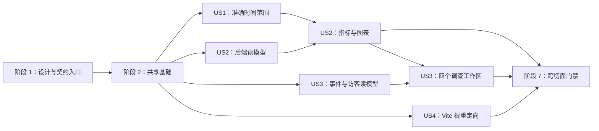

# 任务：监控 Dashboard 体验修复

**输入**：`/specs/011-analytics-dashboard-remediation/` 下的 `spec.md`、`plan.md`、`research.md`、`data-model.md`、`figma.md`、`quickstart.md` 与 `contracts/`

**前置条件**：Pulse v1.1 完整页面真实锚点 `63:2118`、补充状态真实锚点 `67:672` 和四张 Pulse v1.2 HTML 差异画板已经确定；用户已通过 import plugin 导入 v1.2 并提供真实批次锚点 `80:151`，实施不得猜测未机器读取的子画板 ID。

**测试策略**：本规格明确要求自动化测试。每个用户故事先增加并确认相关测试因缺失能力而失败，再实现最小代码使其通过；最终执行 OpenAPI、Go、Vitest、public/monitor build、Playwright、100 万行性能、隐私/DDD/稳健性和 Figma 双端三语门禁。

**组织方式**：任务按共享基础和四个用户故事分组。`[P]` 只表示任务修改不同文件且没有未完成依赖，可并行执行；`[USn]` 对应 `spec.md` 的用户故事。

## 阶段 1：设置（设计与契约入口）

**目的**：先完成真实设计追溯和契约工具入口，避免实现引用旧 010 路径或虚构 Figma 节点。

- [X] T001 使用 `docs/superpowers/prototypes/2026-07-23-analytics-dashboard-remediation-figma-import/README.md` 将 14–17 四张差异画板导入既有 Figma 文件，并在 `specs/011-analytics-dashboard-remediation/figma.md` 回填用户提供的真实批次锚点 `80:151`、导入日期和“已导入”状态
- [ ] T002 [P] 将 feature OpenAPI lint/bundle 脚本从 010 切换到 011，并保留 download/route 既有契约校验，路径：`frontend/package.json`
- [ ] T003 将 `specs/011-analytics-dashboard-remediation/contracts/analytics-monitoring-api.openapi.yaml` 单向同步到 `shared/contracts/openapi/analytics-monitoring-api.openapi.yaml`，不得反向改写 feature 权威源
- [ ] T004 [P] 为 Dashboard 非 HTTP 行为契约建立可执行追踪矩阵，映射 FR/SC 到 Vitest、Go 和 Playwright 测试路径，路径：`specs/011-analytics-dashboard-remediation/verification-matrix.md`

---

## 阶段 2：基础设施（阻塞前置）

**目的**：先同步跨故事共享的类型、三语文案入口、视觉 token、fixture 和契约验证。此阶段完成前不开始页面实现。

### 基础测试与契约

- [ ] T005 [P] 为 `latencyByEvent`、逐日 HeatmapCell、EventRangeSummary、visitor eventComposition/commonPlatform 和七个 operationId 编写先失败的 OpenAPI 结构测试；明确断言 011 `heatmap[]` 只接受逐日字段并拒绝旧 `weekday/hour`，路径：`frontend/src/monitoring/services/analyticsContract.test.ts`
- [ ] T006 [P] 为新增日期、比较状态、UV、Tooltip、热力图、四页区块和局部降级 key 的三语完整性编写先失败测试，路径：`frontend/src/monitoring/content/copy.test.ts`
- [ ] T007 [P] 扩展固定私有 API fixture，使新字段具备 ready、无数据、无同期、无成功样本和辅助 system 失败数据，路径：`frontend/playwright-monitor/fixtures/analytics.ts`、`frontend/playwright-monitor/fixtures/details.ts`

### 基础实现

- [ ] T008 按 011 OpenAPI 更新 TypeScript `OverviewData`、`HeatmapCell`、`EventRangeSummary`、`EventListData` 和 `VisitorSummary`，并修正现有缩进，路径：`frontend/src/monitoring/services/analyticsTypes.ts`
- [ ] T009 [P] 在三语 copy 类型中声明日期校验、比较状态、成功地点/路线 UV、图例/Tooltip、工作区区块和配置事实 key，路径：`frontend/src/monitoring/content/types.ts`
- [ ] T010 [P] 在 `frontend/src/monitoring/styles/tokens.css` 建立页面标题、卡片标题、正文、辅助、标签、40/36px 指标和 32px 长值下限 token，禁止保留 7–10px 可见文字 token
- [ ] T011 运行 T005–T010 的契约与类型检查，并确认失败只来自尚未实现的用户故事行为，路径：`frontend/src/monitoring/services/analyticsContract.test.ts`、`frontend/src/monitoring/content/copy.test.ts`

**检查点**：011 OpenAPI、前端类型、三语 key、视觉 token 和 deterministic fixture 稳定，可以开始用户故事实现。

---

## 阶段 3：用户故事 1 - 查看包含当天的准确统计（优先级：P1）MVP

**目标**：7/30/90 天与自定义范围按香港自然日准确包含今天，刷新推进当前时刻，固定历史范围不漂移。

**独立测试**：固定香港时间 00:30，在非香港浏览器时区验证预设、自定义、跨月/跨年、非法范围、上一等长周期、手动刷新和一次 60 秒自动刷新。

### 用户故事 1 的测试与验证

- [ ] T012 [P] [US1] 为预设 7/30/90 天、香港 00:30、非香港浏览器时区、跨月/跨年、自定义首尾包含和非法日期编写先失败纯函数测试，路径：`frontend/src/monitoring/model/dateRange.test.ts`
- [ ] T013 [P] [US1] 为 selection 与 refresh anchor 分离、手动刷新推进今天 `to`、历史范围不漂移，以及切换语言/工作区时日期与筛选不重置编写先失败 provider 测试，路径：`frontend/src/monitoring/app/FilterProvider.test.tsx`
- [ ] T014 [P] [US1] 为 7/30/90、自定义起止、控件旁三语错误、错误时不发查询和 44px 手机操作编写先失败组件测试，路径：`frontend/src/monitoring/components/filters/GlobalFilters.test.tsx`
- [ ] T015 [P] [US1] 为总览成功后 60 秒重新求值、无请求叠加、失败不自动循环和手动重试保留范围编写先失败测试，路径：`frontend/src/monitoring/pages/OverviewPage.test.tsx`
- [ ] T016 [US1] 以固定时钟和 API fixture 编写包含当天、手动/自动刷新、自定义日期及三语校验的桌面/手机先失败 E2E，路径：`frontend/playwright-monitor/time-range.spec.ts`

### 用户故事 1 的实现

- [ ] T017 [US1] 实现 `DateRangeSelection`、`ResolvedDateRange`、香港日历运算、上一等长周期与校验错误，并用中文注释解释半开区间和今天/历史结束日差异，路径：`frontend/src/monitoring/model/dateRange.ts`
- [ ] T018 [US1] 将全局状态改为保存日期 selection，并让筛选、手动刷新和总览自动刷新使用新的 clock anchor 重新求值；确保语言/工作区切换不重挂 provider 或清空日期与筛选，路径：`frontend/src/monitoring/app/FilterProvider.tsx`
- [ ] T019 [US1] 实现预设按钮、自定义开始/结束日期、内联错误、比较开关和双端可达交互，路径：`frontend/src/monitoring/components/filters/GlobalFilters.tsx`
- [ ] T020 [P] [US1] 补齐预设、自定义、日期错误、包含今天、刷新与比较的 `zh-Hant`、`zh-Hans`、`en` 自然文案，路径：`frontend/src/monitoring/content/copy.ts`
- [ ] T021 [US1] 让总览自动刷新调用全局 refresh 重新计算查询，并保持 AbortController、成功后调度和失败后手动重试语义，路径：`frontend/src/monitoring/pages/OverviewPage.tsx`
- [ ] T022 [US1] 为日期控件、错误和移动布局应用 15/14px 正文、13/12px 辅助及 44px 触摸目标，路径：`frontend/src/monitoring/styles/dashboard.css`、`frontend/src/monitoring/styles/responsive.css`
- [ ] T023 [US1] 运行日期单元/组件/E2E 测试并保存 1440×1200 与 390×844 自定义日期视觉证据，路径：`frontend/playwright-monitor/__screenshots__/time-range-desktop.png`、`frontend/playwright-monitor/__screenshots__/time-range-mobile.png`

**检查点**：不依赖 US2/US3 的视觉重构即可独立证明所有工作区使用准确的香港查询范围，US1 构成时间正确性 MVP。

---

## 阶段 4：用户故事 2 - 快速读懂指标与趋势（优先级：P1）

**目标**：统一大字号指标、明确比较状态、Grafana 式可访问折线、四类事件 P95 和逐日热力图，使维护者无需查看文档即可解释数据。

**独立测试**：固定 ready/no-data/no-comparison fixture，在 1440×1200 与 390×844 检查指标字号、图例/坐标/Tooltip/键盘焦点、隐藏表格、P95 和日期格数量。

### 用户故事 2 的后端测试

- [ ] T024 [P] [US2] 为四类事件稳定顺序、只统计成功样本、最近秩 P95 和无样本 null，以及 overview/traffic/downloads/performance 在上一周期无匹配事件时 `previousValue/delta/deltaRate` 全为 null、真实零值仍可比较编写先失败应用测试，路径：`backend/internal/analytics/application/query_overview_test.go`、`backend/internal/analytics/application/query_details_test.go`
- [ ] T025 [P] [US2] 为逐日香港桶、7/30/90 格、零事件日期、首尾截断、eventCount/UV 和排序编写先失败应用测试，路径：`backend/internal/analytics/application/query_details_test.go`
- [ ] T026 [P] [US2] 为 overview/traffic JSON 与 011 schema、旧路径/operationId 不变、Heatmap 响应不含旧 `weekday/hour`、无敏感字段编写先失败 handler 契约测试，路径：`backend/internal/analytics/interfaces/http/private_handlers_test.go`、`backend/internal/analytics/interfaces/http/privacy_sentinel_test.go`

### 用户故事 2 的前端测试

- [ ] T027 [P] [US2] 为正负、持平、无同期、比较关闭、当前缺失、长值下限和无装饰节点编写先失败测试，路径：`frontend/src/monitoring/components/charts/MetricCard.test.tsx`
- [ ] T028 [P] [US2] 为顶部完整图例、X/Y 轴、网格、点、十字线、鼠标/键盘共享 Tooltip、隐藏数据表、无可见摘要和空状态编写先失败测试，路径：`frontend/src/monitoring/components/charts/TimeSeriesChart.test.tsx`
- [ ] T029 [P] [US2] 为逐日七行周布局、真实日期数、补位格、事件/UV Tooltip、强度图例和内部横向滚动编写先失败测试，路径：`frontend/src/monitoring/components/charts/Heatmap.test.tsx`
- [ ] T030 [P] [US2] 为总览四类事件 P95、流量页地点/路线 UV 标签和 PV/UV/路线 UV 图例编写先失败页面测试，路径：`frontend/src/monitoring/pages/OverviewPage.test.tsx`、`frontend/src/monitoring/pages/DetailPages.test.tsx`
- [ ] T031 [US2] 编写三语桌面/手机图表悬停、键盘聚焦、热力图滚动和无可见摘要的先失败 E2E，路径：`frontend/playwright-monitor/charts.spec.ts`

### 用户故事 2 的后端实现

- [ ] T032 [US2] 在应用 DTO 中增加 `EventLatencySummary`、`OverviewData.latencyByEvent`，并把 HeatmapCell 破坏性替换为 localDate/bucketStart/bucketEnd/eventCount/uv，不保留或双写旧 `weekday/hour` 字段，路径：`backend/internal/analytics/application/dto.go`
- [ ] T033 [US2] 按四类既有事件聚合成功请求数和可空 P95，保留旧全局 latency 字段；统一 `buildMetrics`/`buildMetricsForKeys` 的上一周期可用性规则，无匹配事件时保持 `previousValue/delta/deltaRate=null`，真实零值仍参与计算，路径：`backend/internal/analytics/application/query_overview.go`、`backend/internal/analytics/application/query_details.go`
- [ ] T034 [US2] 用香港日桶生成完整范围逐日热力图，零事件日期仍返回 cell，并用中文注释说明首尾半开边界，路径：`backend/internal/analytics/application/query_details.go`
- [ ] T035 [US2] 保持七个私有路由不变并完成新增 DTO/envelope 映射与受控错误回归，路径：`backend/internal/analytics/interfaces/http/overview_handler.go`、`backend/internal/analytics/interfaces/http/detail_handlers.go`

### 用户故事 2 的前端实现

- [ ] T036 [P] [US2] 实现 `ComparisonState` 纯派生模型，严格区分零差异、上一周期缺失和比较关闭，路径：`frontend/src/monitoring/model/comparisonState.ts`
- [ ] T037 [US2] 重构指标卡使用 ComparisonState、40/36px token、符号+数值+文字，并删除右上圆圈/光斑，路径：`frontend/src/monitoring/components/charts/MetricCard.tsx`
- [ ] T038 [P] [US2] 让 AccessibleChartFrame 只保留 `sr-only` 表格和可访问标题，不渲染可见 figcaption 摘要，路径：`frontend/src/monitoring/components/charts/AccessibleChartFrame.tsx`
- [ ] T039 [US2] 使用现有 Recharts 3.10 实现通用 `TimeSeriesChart`、自定义可聚焦 dot、共享 active bucket、香港刻度与空状态，路径：`frontend/src/monitoring/components/charts/TimeSeriesChart.tsx`
- [ ] T040 [US2] 把现有流量图改为通用图表适配器，支持 PV、UV、成功路线查询 UV 和一致图例，路径：`frontend/src/monitoring/components/charts/TrafficChart.tsx`
- [ ] T041 [US2] 用逐日 API cell 实现七行周网格、范围外补位、事件/UV Tooltip、强度图例和局部横向滚动，路径：`frontend/src/monitoring/components/charts/Heatmap.tsx`
- [ ] T042 [US2] 用 `latencyByEvent` 渲染 APK 元数据、地点查询、路线查询、下载响应四条成功请求 P95，并对 null 显示缺失状态，路径：`frontend/src/monitoring/pages/OverviewPage.tsx`
- [ ] T043 [US2] 明确渲染成功地点查询 UV、成功路线查询 UV 及按匿名浏览器去重说明，并接入三序列图和逐日热力图，路径：`frontend/src/monitoring/pages/TrafficPage.tsx`
- [ ] T044 [P] [US2] 补齐比较状态、图例、坐标、Tooltip、P95、UV 口径、热力图和空状态三语文案，路径：`frontend/src/monitoring/content/copy.ts`
- [ ] T045 [US2] 应用新字号、图表、Tooltip、热力图和只局部滚动样式，清除 dashboard/响应式文件中的 7–10px 可见字号，路径：`frontend/src/monitoring/styles/dashboard.css`、`frontend/src/monitoring/styles/responsive.css`、`frontend/src/monitoring/styles/accessibility.css`
- [ ] T046 [US2] 运行后端/前端/图表 E2E，并保存三语 1440×1200 与 390×844 指标、Tooltip 和热力图证据，路径：`frontend/playwright-monitor/__screenshots__/charts-zh-Hans-desktop.png`、`frontend/playwright-monitor/__screenshots__/charts-zh-Hant-mobile.png`、`frontend/playwright-monitor/__screenshots__/charts-en-desktop.png`

**检查点**：US2 可独立展示准确、可读、可键盘操作的指标和趋势；与 US1 组合后形成可发布的监控正确性 MVP。

---

## 阶段 5：用户故事 3 - 完成端到端调查（优先级：P2）

**目标**：恢复事件、访客、性能和系统四个工作区的完整调查路径、真实汇总、分页、会话、局部降级和动态/配置事实分离。

**独立测试**：从完整范围事件摘要和分页进入 22 位匿名 visitor，查看 30 分钟会话、P50/P95/失败/端点，再确认动态系统状态；system 辅助失败时性能页除 Dropped 外仍可用。

### 用户故事 3 的后端测试

- [ ] T047 [P] [US3] 为完整筛选范围 total/success/failure/uniqueVisitors、游标不影响摘要和 pageInfo.totalCount 一致性编写先失败应用测试，路径：`backend/internal/analytics/application/query_details_test.go`
- [ ] T048 [P] [US3] 为事件摘要复用全部过滤条件、`COUNT(DISTINCT visitor_id)`、50 条游标分页和 100 万行 query plan 编写先失败 SQLite 测试，路径：`backend/internal/analytics/infrastructure/sqlite/query_events_visitor_test.go`、`backend/internal/analytics/infrastructure/sqlite/performance_test.go`
- [ ] T049 [P] [US3] 为 visitor 完整历史事件构成、count 总和、常见平台和无下载 null、30 分钟会话不受分页影响编写先失败应用测试，路径：`backend/internal/analytics/application/query_details_test.go`
- [ ] T050 [P] [US3] 为 events/visitor 响应对齐 011 OpenAPI、Visitor ID 仍只用 header 和敏感信息零命中编写先失败 handler 测试，路径：`backend/internal/analytics/interfaces/http/private_handlers_test.go`、`backend/internal/analytics/interfaces/http/privacy_sentinel_test.go`

### 用户故事 3 的前端测试

- [ ] T051 [P] [US3] 为完整范围四指标、隐私提示、桌面 50 条表格、手机 key-value 卡、访客跳转和分页编写先失败测试，路径：`frontend/src/monitoring/pages/EventsPage.test.tsx`、`frontend/src/monitoring/components/tables/ResponsiveEventList.test.tsx`
- [ ] T052 [P] [US3] 为 22 位精确搜索/复制反馈、四指标、事件构成、可空平台、返回事件页和 30 分钟会话编写先失败测试，路径：`frontend/src/monitoring/pages/VisitorPage.test.tsx`、`frontend/src/monitoring/components/timeline/VisitorTimeline.test.tsx`
- [ ] T053 [P] [US3] 为性能六指标、Grafana P50/P95、失败分布、端点表及 system 失败只降级 Dropped 编写先失败测试，路径：`frontend/src/monitoring/pages/PerformancePage.test.tsx`
- [ ] T054 [P] [US3] 为系统四动态状态卡、运行/存储/隔离区块、配置事实标签、无虚构队列和无敏感值编写先失败测试，路径：`frontend/src/monitoring/pages/SystemPage.test.tsx`
- [ ] T055 [US3] 编写两分钟调查路径、五种状态、三语 1440/390 信息架构和性能局部降级先失败 E2E；先设置自定义日期、筛选和 Visitor ID，再切换三语、工作区并执行失败重试，逐步断言调查上下文不丢失，路径：`frontend/playwright-monitor/investigation.spec.ts`、`frontend/playwright-monitor/states.spec.ts`

### 用户故事 3 的后端实现

- [ ] T056 [US3] 增加 `EventRangeSummary`、StoredEventPage summary、visitor eventComposition/commonPlatform DTO 与应用端口，路径：`backend/internal/analytics/application/dto.go`、`backend/internal/analytics/application/ports.go`
- [ ] T057 [US3] 复用 query builder 的时间、事件、结果、语言、设备、来源、平台、版本和 Visitor ID 条件实现摘要 SQL 与分页 SQL，路径：`backend/internal/analytics/infrastructure/sqlite/query_builder.go`、`backend/internal/analytics/infrastructure/sqlite/query_events_visitor.go`
- [ ] T058 [US3] 输出事件完整范围摘要，并从 visitor 完整历史计算事件构成和可空常见平台，保持会话与分页语义，路径：`backend/internal/analytics/application/query_details.go`
- [ ] T059 [US3] 映射 events/visitor 新字段、保持现有错误/路由/header 和 no-store，路径：`backend/internal/analytics/interfaces/http/detail_handlers.go`

### 用户故事 3 的前端实现

- [ ] T060 [US3] 更新私有 client 类型消费事件摘要和 visitor 扩展，保持 Visitor ID 只通过 `X-Analytics-Visitor-ID` header，路径：`frontend/src/monitoring/services/analyticsDetailsClient.ts`
- [ ] T061 [US3] 恢复事件页面筛选、隐私边界、四张完整范围指标、桌面表格与条目范围/总数/页位置，路径：`frontend/src/monitoring/pages/EventsPage.tsx`、`frontend/src/monitoring/components/tables/EventTable.tsx`
- [ ] T062 [US3] 恢复手机 key-value 事件卡、查看匿名访客和 44px 可达分页，路径：`frontend/src/monitoring/components/tables/ResponsiveEventList.tsx`
- [ ] T063 [US3] 恢复 visitor 完整 ID 搜索/复制/返回、四指标、事件构成、常见分类/空平台和会话时间线，路径：`frontend/src/monitoring/pages/VisitorPage.tsx`、`frontend/src/monitoring/components/timeline/VisitorTimeline.tsx`
- [ ] T064 [US3] 并行读取 performance 与 system，渲染六指标、通用 P50/P95 图、失败分布和端点表，并让 system 失败只影响 Dropped，路径：`frontend/src/monitoring/pages/PerformancePage.tsx`、`frontend/src/monitoring/pages/useDetailResource.ts`
- [ ] T065 [P] [US3] 用有类型常量定义长期保留、无备份、无写入队列、无公网代理、只存明细等配置事实，路径：`frontend/src/monitoring/model/systemFacts.ts`
- [ ] T066 [US3] 恢复系统四张动态状态卡和运行状态/存储概况/隔离与降级区块，明确标记配置事实且不展示敏感信息，路径：`frontend/src/monitoring/pages/SystemPage.tsx`
- [ ] T067 [P] [US3] 补齐事件、visitor、性能、系统、复制反馈、会话、局部降级和配置事实的三语自然文案，路径：`frontend/src/monitoring/content/copy.ts`、`frontend/src/monitoring/content/types.ts`
- [ ] T068 [US3] 按 Pulse v1.1 信息架构和 v1.2 字号重构表格、卡片、时间线、端点和系统响应式样式，路径：`frontend/src/monitoring/styles/dashboard.css`、`frontend/src/monitoring/styles/mobile-components.css`、`frontend/src/monitoring/styles/responsive.css`
- [ ] T069 [US3] 运行四页单元/E2E 并保存桌面/手机三语及 system 局部失败视觉证据，路径：`frontend/playwright-monitor/__screenshots__/investigation-zh-Hans-desktop.png`、`frontend/playwright-monitor/__screenshots__/investigation-zh-Hant-mobile.png`、`frontend/playwright-monitor/__screenshots__/performance-system-partial-error.png`

**检查点**：US3 可在两分钟内完成事件→visitor→性能→系统调查；任何单个辅助查询失败只影响对应区块，公开业务不受影响。

---

## 阶段 6：用户故事 4 - 从默认语言进入本地公开主页（优先级：P3）

**目标**：公开主页 Vite dev 与 preview 对 GET/HEAD 精确 `/` 返回 302 到 `/zh-hant/`，所有其他入口保持原行为。

**独立测试**：分别在 dev/preview 验证 GET/HEAD 根路径、POST 根路径、本地化路径、静态资源、API、监控 Vite 与正式构建不受影响。

### 用户故事 4 的测试与验证

- [ ] T070 [P] [US4] 为 GET/HEAD 精确根路径 302/Location/HEAD 空体及 POST、locale、asset、api 调用 next 编写先失败中间件测试，路径：`frontend/src/tests/viteRootRedirect.test.ts`
- [ ] T071 [US4] 编写启动随机端口 dev 与 preview 的进程级验证，断言 monitor config 未安装插件且非根路径行为不变，路径：`frontend/scripts/verify-vite-root-redirect.mjs`

### 用户故事 4 的实现

- [ ] T072 [US4] 实现同时供 `configureServer` 与 `configurePreviewServer` 使用的公开根路径 302 插件，并用中文注释解释精确 pathname/method 边界，路径：`frontend/viteRootRedirect.ts`
- [ ] T073 [US4] 只在公开 `frontend/vite.config.ts` 安装 root redirect plugin，保持 `frontend/vite.monitor.config.ts`、代理、host 和 port 配置不变
- [ ] T074 [US4] 运行中间件与 dev/preview 进程级验证，并在 `specs/011-analytics-dashboard-remediation/verification-matrix.md` 记录 GET/HEAD/非根路径实际结果

**检查点**：US4 可独立验证本地默认繁中入口，且不改变监控入口或正式部署拓扑。

---

## 阶段 7：打磨与跨切面门禁

**目的**：完成契约、三语、性能、隐私、稳健性、视觉和全链路验证，使所有用户故事可共同实施发布。

- [ ] T075 将实现后的 011 OpenAPI 再次同步到 shared，运行 feature/shared lint、bundle 和中文 API UI 生成，并确认 docs 不进入公网 `frontend/dist`，路径：`shared/contracts/openapi/analytics-monitoring-api.openapi.yaml`、`shared/contracts/openapi/analytics-monitoring-api.bundle.yaml`、`shared/contracts/openapi/docs/analytics-monitoring-api.html`
- [ ] T076 [P] 完成新增三语文案的香港繁中、自然克制英文、UV/PV/隐私/配置事实语义审校并记录非机械直译结论，路径：`specs/011-analytics-dashboard-remediation/zh-hant-en-copy-review.md`
- [ ] T077 [P] 扩展显式 1,000,000 行 fixture 与 `EXPLAIN QUERY PLAN` 断言，证明事件摘要、逐日桶、总览和 visitor 时间线 95% 在 1 秒内且不新增汇总表，路径：`backend/internal/analytics/infrastructure/sqlite/performance_test.go`
- [ ] T078 根据 T077 证据优先优化 query builder；只有仍不达标时才新增只创建普通索引的前向 `002_add_analytics_query_indexes.sql`，并用已执行 001 的旧数据库 fixture 验证升级与重复 Migrate 幂等，绝不修改 001，也不增加表、缓存、队列、清理或备份，路径：`backend/internal/analytics/infrastructure/sqlite/query_builder.go`、`backend/internal/analytics/infrastructure/sqlite/migrations/002_add_analytics_query_indexes.sql`、`backend/internal/analytics/infrastructure/sqlite/migrations_test.go`
- [ ] T079 [P] 运行 `go test ./backend/...`、目标 SQLite 性能测试和 handler 隐私 sentinel，记录实际命令与结果，路径：`specs/011-analytics-dashboard-remediation/verification-results.md`
- [ ] T080 [P] 运行前端全量 Vitest、TypeScript、public/monitor build，确认 `dist`/`dist-monitor` 物理隔离、monitor bundle 不进入公网，并记录 011 monitor bundle 只消费逐日 Heatmap schema，路径：`specs/011-analytics-dashboard-remediation/verification-results.md`
- [ ] T081 运行 public/monitor Playwright，生成七工作区 × 三语 × 1440/390 及五种状态的最终视觉证据，路径：`frontend/playwright-monitor/__screenshots__/`、`frontend/playwright/__screenshots__/`
- [ ] T082 审计 analytics DDD 依赖方向、无业务 panic、public/private recovery/logger、无新无保护 goroutine、脱敏错误和公开 fail-open，路径：`backend/internal/analytics/`、`backend/internal/platform/httpserver/`、`backend/cmd/server/`
- [ ] T083 审计只有既有四类匿名事件，且无 IP/指纹/完整 UA/Referrer/查询内容/敏感系统值、无公开监控端点、无汇总表/导出/删除/清理/备份，路径：`backend/internal/analytics/interfaces/http/privacy_sentinel_test.go`、`specs/011-analytics-dashboard-remediation/spec.md`
- [ ] T084 对照 Figma v1.1 `63:2118`/`67:672`、v1.2 真实回填锚点、四张导出画板和最终三语双端截图记录一致性与有意差异，路径：`specs/011-analytics-dashboard-remediation/figma.md`
- [ ] T085 执行 `specs/011-analytics-dashboard-remediation/quickstart.md` 的 OpenAPI、日期、Go、前端、本地三进程、Figma、性能和隐私步骤；运行部署脚本测试确认私有后端与 `dist-monitor` 同一发布物原子升级/整体回滚且不能新旧混搭，并汇总所有通过/失败证据，路径：`scripts/tests/deploy_test.sh`、`specs/011-analytics-dashboard-remediation/verification-results.md`
- [ ] T086 运行 `git diff --check` 和任务/需求追踪检查，确认提交范围不包含用户现有 `backend/downloads/android/BusIsComing.apk`、`backend/downloads/android/current.json` 改动，路径：`specs/011-analytics-dashboard-remediation/verification-matrix.md`

---

## 依赖与执行顺序

### 阶段依赖

- **阶段 1 设置**：无代码依赖；T001 设计追溯门禁已由用户完成，T002–T004 可立即开始。
- **阶段 2 基础设施**：依赖阶段 1 的契约路径稳定，阻塞所有用户故事。
- **US1（阶段 3）**：依赖阶段 2；完成后所有工作区具有正确时间范围。
- **US2（阶段 4）**：依赖阶段 2 的类型/token；后端聚合可与 US1 前端日期实现并行，但最终 E2E 依赖 US1 的准确范围。
- **US3（阶段 5）**：依赖阶段 2；后端事件/visitor 扩展可与 US1/US2 并行，页面最终视觉依赖 US2 的 token 与通用图表。
- **US4（阶段 6）**：只依赖阶段 2，技术上可独立并行；按优先级在监控修复后交付。
- **阶段 7 打磨**：依赖四个故事完成并通过各自检查点。

### 单个用户故事内部顺序

- 先编写并确认测试因缺失能力失败，再按契约/领域 → 应用 → 基础设施/接口 → 前端 → E2E/视觉实现。
- OpenAPI 与 TypeScript 类型先于 DTO/handler/client；handler 不计算统计，SQLite 不泄露到 application/domain。
- 日期、Metric null、日桶、摘要过滤、Heatmap 破坏性契约、Recharts 键盘状态、system 配置事实和 Vite 边界随实现写中文注释。
- 三语文案和双端样式与组件同故事完成，不推迟到最终阶段首次实现。
- 每个故事检查点前完成对应 1440px 与 390px 验证；阶段 7 只做跨故事回归。

### 并行机会

- T005–T007 分别修改契约、文案和 fixture，可并行。
- US1 的 T012–T015 可并行写测试；实现按 T017 → T018/T019 → T021 收敛。
- US2 后端 T024–T026、前端 T027–T030 可并行；T032–T035 与 T036–T041 在 OpenAPI/类型稳定后分层并行。
- US3 的事件摘要、visitor、四个页面测试可分组并行；T061–T066 修改不同组件时可并行，T068 统一样式时再收敛。
- US4 可在阶段 2 后与 US1–US3 并行，但不得修改 monitor Vite 配置。
- 阶段 7 的 OpenAPI、后端、前端和文案审校可并行，最终由 T084–T086 汇总。

## 实施策略

### 可发布 MVP

1. 完成阶段 1 与阶段 2。
2. 完成 US1，证明今天事件和刷新语义正确。
3. 完成 US2，证明指标、图表、P95 和热力图可解释。
4. 停止并运行 US1+US2 独立验证；这两项构成监控正确性 MVP。

### 增量交付

1. 设置 + 基础设施 → 稳定契约、类型、token 和 fixture。
2. US1 → 时间范围和刷新正确。
3. US2 → 大字号、比较状态、Grafana 图表、事件 P95 和逐日热力图。
4. US3 → 事件、visitor、性能、系统完整调查闭环。
5. US4 → 公开 Vite dev/preview 默认繁中入口。
6. 阶段 7 → OpenAPI、三语、双端、性能、隐私、稳健性和 Figma 最终门禁。

## 备注

- `[P]` 不表示可绕过契约、测试或同文件冲突；同一文件任务仍按编号执行。
- v1.2 Figma 真实导入批次锚点为 `80:151`；任何实施者都不得把逻辑画板名、本地截图路径或未机器读取的子画板猜测值伪装成节点 ID。
- 设计示例数值不得作为 API 缺失或失败的回退值。
- 不得改变 anonymous visitor Cookie、机器人过滤、只统计主页、长期明细、无备份、无删除、无版本重载、监控私有访问和公开 fail-open 等 010 决策。
- 每次 Spec Kit skill 完成并验证通过后按仓库宪法自动提交；产品实现提交仍须排除用户 APK/版本文件改动。
