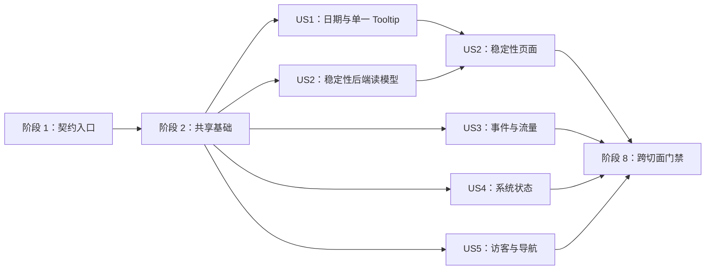

# 任务：监控 Dashboard 数据解释与技术监控增强

**输入**：`/specs/012-analytics-dashboard-observability/` 下的 `spec.md`、`plan.md`、
`research.md`、`data-model.md`、`figma.md`、`quickstart.md` 与 `contracts/`

**前置条件**：Pulse v1.3 五张画板已由用户导入既有 Figma 文件，真实锚点为
[89:1310](https://www.figma.com/design/LAm6RjzFuFHsHFlcipx8pU/BusIsComing-Website---Homepage-v1-Spec?node-id=89-1310)；
实现以该节点、011 现有行为和 012 两份契约为依据。不得使用 Figma 示例数值回退。

**测试策略**：本规格明确要求自动化测试。每个用户故事先增加测试并确认因缺失能力失败，再实现
最小代码使其通过；最终执行 OpenAPI、Go/race、Vitest、双构建、monitor Playwright、100 万行
性能、隐私/DDD/稳健性、Figma 双端三语和部署隔离门禁。

**组织方式**：任务按共享基础和五个用户故事分组。`[P]` 只表示修改不同文件且没有未完成依赖；
`[USn]` 对应 `spec.md` 的用户故事。

## 阶段 1：设置（契约与追踪入口）

**目的**：把实现工具链切到 012 权威契约，并建立可追踪验证入口。

- [ ] T001 将 analytics feature lint/bundle 路径从 011 切换到 012，保留 download/route 既有契约命令，路径：`frontend/package.json`
- [ ] T002 [P] 将 analytics OpenAPI 契约测试的 featurePath 和标题切换到 012，保留既有 operation 基线断言；新增 schema 断言统一由 T005 编写，路径：`frontend/src/monitoring/services/analyticsContract.test.ts`
- [ ] T003 将 `specs/012-analytics-dashboard-observability/contracts/analytics-monitoring-api.openapi.yaml` 单向同步到 `shared/contracts/openapi/analytics-monitoring-api.openapi.yaml`，不得反向修改 feature 权威源
- [ ] T004 [P] 建立 FR/SC→OpenAPI/Go/Vitest/Playwright/Figma/人工检查的验证矩阵，路径：`specs/012-analytics-dashboard-observability/verification-matrix.md`

---

## 阶段 2：基础设施（阻塞前置）

**目的**：先稳定跨故事共享的契约、TypeScript 类型、fixture、比较模型和三语 key。此阶段完成前
不开始页面实现。

### 基础测试与契约

- [ ] T005 [P] 为 EventListData.summaryMetrics、Traffic 六项 key、PercentileComparison、SLISeriesPoint、SystemData.sqlite/uptime 和七个 operationId 编写先失败的结构测试，路径：`frontend/src/monitoring/services/analyticsContract.test.ts`
- [ ] T006 [P] 扩展私有 API fixture，覆盖当前/上期、零基线、无样本、SLI 空桶、system 单字段 null、流量六卡和 visitor 无平台，路径：`frontend/playwright-monitor/fixtures/analytics.ts`、`frontend/playwright-monitor/fixtures/details.ts`
- [ ] T007 [P] 为新增导航、日期步骤、比较七状态、分位、SLI、system、六卡和访客偏好 key 编写三语完整性先失败测试，路径：`frontend/src/monitoring/content/copy.test.ts`
- [ ] T008 [P] 为 neutral/lower-is-better、持平、零基线、无上期、无当前和关闭比较编写先失败纯函数测试，路径：`frontend/src/monitoring/model/comparisonState.test.ts`

### 基础实现

- [ ] T009 按 012 OpenAPI 更新 EventListData、TrafficData、PercentileComparison、SLISeriesPoint、PerformanceData 和 SystemData TypeScript 类型，路径：`frontend/src/monitoring/services/analyticsTypes.ts`
- [ ] T010 [P] 在三语类型中声明新导航、日期步骤、比较状态、P50/P95、SLI、system、流量六卡和访客偏好 key，路径：`frontend/src/monitoring/content/types.ts`
- [ ] T011 实现七种 ComparisonViewState，并把变化方向与 neutral/lower-is-better 好坏策略分离；用中文注释解释零基线和反向语义，路径：`frontend/src/monitoring/model/comparisonState.ts`
- [ ] T012 更新 MetricCard 公共 props 类型以支持 `count`、`percent`、`durationMs` 和好坏策略，但暂不改变各页面布局，路径：`frontend/src/monitoring/components/charts/MetricCard.tsx`
- [ ] T013 运行 T005–T012 的 OpenAPI lint、契约、类型和纯函数测试，确认剩余失败只来自未实现用户故事，路径：`specs/012-analytics-dashboard-observability/verification-matrix.md`

**检查点**：012 契约、shared 源、TypeScript 类型、fixture、比较模型和三语 key 稳定，可以开始
用户故事。

---

## 阶段 3：用户故事 1 - 可信地选择时间并读取图表（优先级：P1）MVP

**目标**：维护者按开始→结束两步应用自定义范围，右上角与高级筛选同步；鼠标和键盘任意时刻
最多显示一个 Tooltip。

**独立测试**：从近 30 天选择自定日期，分别验证自动 picker、fallback、取消、非法范围、跨年、
两处同步和一次刷新；再交替 hover/focus 图表点，始终只有一个可见 Tooltip。

### 用户故事 1 的测试与验证

- [ ] T014 [P] [US1] 为 idle/selecting_start/selecting_end、取消、非法范围和 fallback 编写先失败状态机测试，路径：`frontend/src/monitoring/model/dateRangeFlow.test.ts`
- [ ] T015 [P] [US1] 为 showPicker 成功/缺失/抛异常、两步标签、结束后一次提交和 44px 操作编写先失败组件测试，路径：`frontend/src/monitoring/components/filters/DateRangeControl.test.tsx`
- [ ] T016 [P] [US1] 为预设/自定义两处同步、取消不改 query、跨年完整年份和切换语言/页面不丢状态编写先失败 provider/filter 测试，路径：`frontend/src/monitoring/app/FilterProvider.test.tsx`、`frontend/src/monitoring/components/filters/GlobalFilters.test.tsx`
- [ ] T017 [P] [US1] 为 pointer/keyboard/null 互斥、输入方式切换、blur/leave/data change 清理和共用格式化编写先失败图表测试，路径：`frontend/src/monitoring/components/charts/TimeSeriesChart.test.tsx`
- [ ] T018 [US1] 用真实浏览器编写两步日期与真正 hover/focus 后可见 Tooltip 数量等于 1 的先失败桌面/手机 E2E，路径：`frontend/playwright-monitor/time-range.spec.ts`、`frontend/playwright-monitor/charts.spec.ts`

### 用户故事 1 的实现

- [ ] T019 [US1] 实现 CustomDateFlow 纯状态机并用中文注释区分草稿与已应用范围，路径：`frontend/src/monitoring/model/dateRangeFlow.ts`
- [ ] T020 [US1] 实现原生两步 DateRangeControl、showPicker 能力检测、异常 fallback、取消和完整 aria-label，路径：`frontend/src/monitoring/components/filters/DateRangeControl.tsx`
- [ ] T021 [US1] 在右上角接入 DateRangeControl，显示已应用起止日期并移除忽略 custom 的分支，路径：`frontend/src/monitoring/components/layout/DashboardShell.tsx`
- [ ] T022 [US1] 让高级筛选草稿始终从同一 resolvedRange 同步，应用后更新右上角且只触发一次查询，路径：`frontend/src/monitoring/components/filters/GlobalFilters.tsx`、`frontend/src/monitoring/app/FilterProvider.tsx`
- [ ] T023 [US1] 重构 TimeSeriesChart 为显式最近输入方式，pointer 只显示 Recharts Tooltip、keyboard 只显示自定义提示，并统一 reference line/formatter，路径：`frontend/src/monitoring/components/charts/TimeSeriesChart.tsx`
- [ ] T024 [P] [US1] 补齐日期两步、选择结束、fallback、取消、非法范围、跨年和单一 Tooltip 的三语自然文案，路径：`frontend/src/monitoring/content/copy.ts`
- [ ] T025 [US1] 实现桌面/手机日期弹层、完整范围标签、Tooltip 层级和至少 44px 触控样式，路径：`frontend/src/monitoring/styles/dashboard.css`、`frontend/src/monitoring/styles/responsive.css`、`frontend/src/monitoring/styles/accessibility.css`
- [ ] T026 [US1] 运行 US1 Vitest/Playwright 并保存 1440×1200 与 390×844 日期/单一 Tooltip 证据，路径：`frontend/playwright-monitor/__screenshots__/time-range-desktop.png`、`frontend/playwright-monitor/__screenshots__/time-range-mobile.png`
- [ ] T027 [US1] 对照 Figma `89:1310` 的 Date Range & Single Tooltip 画板记录逐区块一致性和有意差异，路径：`specs/012-analytics-dashboard-observability/verification-matrix.md`

**检查点**：US1 可独立证明日期范围可信且图表不存在重复 Tooltip。

---

## 阶段 4：用户故事 2 - 调查稳定性与时延变化（优先级：P1）

**目标**：稳定性工作区默认单独查看 P95，可切 P50，展示四类 SLI 和端点 P50/P95 同期比较，
并正确处理单位、零基线和缺失样本。

**独立测试**：用含四类事件、SLI 空桶、全失败桶、端点持平/变快/变慢/零基线/无样本的 fixture
打开页面，切换分位时只有响应时间图改变。

### 用户故事 2 的后端测试

- [ ] T028 [P] [US2] 为 SLI 四事件稳定顺序、无请求 null、全失败 0% 和单次遍历分桶编写先失败领域/应用测试，路径：`backend/internal/analytics/domain/aggregation_test.go`、`backend/internal/analytics/application/query_details_test.go`
- [ ] T029 [US2] 在 T028 完成后，为端点 P50/P95 当前/上期、持平、零基线、无当前、无上期和 compare=false 编写先失败应用测试，路径：`backend/internal/analytics/application/query_details_test.go`
- [ ] T030 [P] [US2] 为 PerformanceData 新字段、null 语义、no-store、既有错误 envelope 和 operationId 编写先失败 handler 测试，路径：`backend/internal/analytics/interfaces/http/private_handlers_test.go`

### 用户故事 2 的前端测试

- [ ] T031 [P] [US2] 为 P50/P95 指标 ms、默认 P95、局部切换、SLI 四序列、端点比较七状态和 Dropped 局部降级编写先失败页面测试，路径：`frontend/src/monitoring/pages/PerformancePage.test.tsx`
- [ ] T032 [P] [US2] 为 durationMs 格式、lower-is-better 箭头/颜色/文字和零基线绝对值编写先失败组件测试，路径：`frontend/src/monitoring/components/charts/MetricCard.test.tsx`
- [ ] T033 [US2] 编写 P95→P50、SLI null/0、端点比较和 system 辅助失败的先失败桌面/手机 E2E，路径：`frontend/playwright-monitor/charts.spec.ts`、`frontend/playwright-monitor/investigation.spec.ts`

### 用户故事 2 的后端实现

- [ ] T034 [US2] 实现按香港桶和四类事件计算 SLI 的领域 helper，并用中文注释区分 null 与 0%，路径：`backend/internal/analytics/domain/aggregation.go`、`backend/internal/analytics/domain/results.go`
- [ ] T035 [US2] 增加 PercentileComparison、SLISeriesPoint 和 PerformanceData DTO/应用端口字段，路径：`backend/internal/analytics/application/dto.go`、`backend/internal/analytics/application/ports.go`
- [ ] T036 [US2] 在同一当前/上一查询中聚合四类 SLI 和各 operation P50/P95 比较，上一周期为 0 时只返回绝对变化，路径：`backend/internal/analytics/application/query_details.go`
- [ ] T037 [US2] 保持 performance route/参数/错误不变并映射 012 DTO，确认 handler 不计算统计，路径：`backend/internal/analytics/interfaces/http/detail_handlers.go`

### 用户故事 2 的前端实现

- [ ] T038 [US2] 更新 analytics details client 消费 PercentileComparison、sliSeries 和字段级 null，路径：`frontend/src/monitoring/services/analyticsDetailsClient.ts`
- [ ] T039 [US2] 完成 MetricCard 的 durationMs 和 lower-is-better 展示，确保变化不只依赖颜色，路径：`frontend/src/monitoring/components/charts/MetricCard.tsx`
- [ ] T040 [US2] 重构 PerformancePage：六卡带单位、局部 P50/P95 选择、单分位四线、SLI 四线和端点两列比较，路径：`frontend/src/monitoring/pages/PerformancePage.tsx`
- [ ] T041 [P] [US2] 补齐“稳定性 & 时延”、分位、SLI、端点比较、零基线、无样本和 Dropped 局部失败的三语文案，路径：`frontend/src/monitoring/content/copy.ts`
- [ ] T042 [US2] 实现双图、局部分位选择器、端点比较桌面表/手机语义卡及单位样式，路径：`frontend/src/monitoring/styles/dashboard.css`、`frontend/src/monitoring/styles/mobile-components.css`、`frontend/src/monitoring/styles/responsive.css`
- [ ] T043 [US2] 运行 US2 Go/Vitest/Playwright 并保存三语 1440×1200、390×844 和 system 辅助失败证据，路径：`frontend/playwright-monitor/__screenshots__/performance-v13-desktop.png`、`frontend/playwright-monitor/__screenshots__/performance-v13-mobile.png`、`frontend/playwright-monitor/__screenshots__/performance-system-partial-error.png`
- [ ] T044 [US2] 对照 Figma `89:1310` 的 Stability & SLI 画板记录双图、六卡、端点表和全部比较状态，路径：`specs/012-analytics-dashboard-observability/verification-matrix.md`

**检查点**：US2 可独立定位整体成功率、尾时延和具体 operation；US1+US2 构成调查主路径 MVP。

---

## 阶段 5：用户故事 3 - 比较事件和业务流量（优先级：P2）

**目标**：事件四卡显示完整范围同期变化，流量页同时展示主页/地点/路线六项 PV/UV，并保持既有
成功试查趋势不变。

**独立测试**：启用/关闭 compare，翻到事件第二页后四卡不变；用包含成功/失败和跨桶重复
Visitor 的 fixture 验证六卡及趋势口径。

### 用户故事 3 的后端测试

- [ ] T045 [P] [US3] 为 events 当前/上一 summaryMetrics 共用全部筛选、Visitor header、cursor/limit 不影响摘要和无上期 null 编写先失败应用测试，路径：`backend/internal/analytics/application/query_details_test.go`
- [ ] T046 [P] [US3] 为 SummarizeEvents 复用 query builder、COUNT DISTINCT、当前/上一范围和 query plan 编写先失败 SQLite 测试，路径：`backend/internal/analytics/infrastructure/sqlite/query_events_visitor_test.go`
- [ ] T047 [US3] 在 T045 完成后，为地点/路线 PV 包含失败、各自 UV 完整范围去重和既有成功 Visitor key 不变编写先失败应用测试，路径：`backend/internal/analytics/application/query_details_test.go`
- [ ] T048 [P] [US3] 为 events compare 参数解析、summaryMetrics 响应和七路由不变编写先失败 HTTP 测试；新建 parser 测试文件，不在测试阶段修改生产 parser，路径：`backend/internal/analytics/interfaces/http/private_handlers_test.go`、`backend/internal/analytics/interfaces/http/query_parser_test.go`

### 用户故事 3 的前端测试

- [ ] T049 [P] [US3] 为事件四卡比较七状态、失败反向语义、翻页不改变卡片和 compare 关闭编写先失败测试，路径：`frontend/src/monitoring/pages/EventsPage.test.tsx`
- [ ] T050 [P] [US3] 为主页/地点/路线六卡、PV/UV 标签和既有三序列趋势编写先失败测试，路径：`frontend/src/monitoring/pages/DetailPages.test.tsx`
- [ ] T051 [US3] 编写事件翻页/比较切换、六卡和既有趋势不变的先失败桌面/手机 E2E，路径：`frontend/playwright-monitor/investigation.spec.ts`、`frontend/playwright-monitor/charts.spec.ts`

### 用户故事 3 的后端实现

- [ ] T052 [US3] 增加 EventListData.summaryMetrics 和独立 SummarizeEvents port，保持当前 summary/pageInfo 字段，路径：`backend/internal/analytics/application/dto.go`、`backend/internal/analytics/application/ports.go`
- [ ] T053 [US3] 复用时间、事件、结果、语言、设备、来源、平台、版本和 Visitor header 条件实现不带 cursor/limit 的摘要查询，路径：`backend/internal/analytics/infrastructure/sqlite/query_builder.go`、`backend/internal/analytics/infrastructure/sqlite/query_events_visitor.go`
- [ ] T054 [US3] 编排 events 当前/上一摘要并构造四个 Metric；用中文注释说明分页隔离与无样本语义，路径：`backend/internal/analytics/application/query_details.go`
- [ ] T055 [US3] 扩展 trafficMetricValues 返回 placeQueryVisitors/routeQueryVisitors，同时保留成功 Visitor 和趋势口径，路径：`backend/internal/analytics/application/query_details.go`
- [ ] T056 [US3] 允许 events 消费既有 compare 参数并保持 cursor/header/error/no-store 行为，路径：`backend/internal/analytics/interfaces/http/query_parser.go`、`backend/internal/analytics/interfaces/http/detail_handlers.go`

### 用户故事 3 的前端实现

- [ ] T057 [US3] 更新 client 类型映射并停止 EventsPage 强制 compare=false，路径：`frontend/src/monitoring/services/analyticsDetailsClient.ts`、`frontend/src/monitoring/pages/EventsPage.tsx`
- [ ] T058 [US3] 用 summaryMetrics 渲染事件四卡和失败好坏语义，保持桌面/手机明细与分页，路径：`frontend/src/monitoring/pages/EventsPage.tsx`
- [ ] T059 [US3] 将 TrafficPage 顶部改为主页/地点/路线六卡，保留主页 PV、主页 UV、成功路线 UV 三序列，路径：`frontend/src/monitoring/pages/TrafficPage.tsx`
- [ ] T060 [P] [US3] 补齐筛选结果/成功/失败/独立访客和六项 PV/UV 的三语自然文案与匿名浏览器说明，路径：`frontend/src/monitoring/content/copy.ts`
- [ ] T061 [US3] 实现事件四卡与流量六卡的 1440 六列、390 两列/单列和比较状态样式，路径：`frontend/src/monitoring/styles/dashboard.css`、`frontend/src/monitoring/styles/responsive.css`
- [ ] T062 [US3] 运行 US3 Go/Vitest/Playwright 并保存事件/流量三语双端证据，对照 Figma `89:1310` Business & Event Metrics 画板记录结果，路径：`frontend/playwright-monitor/__screenshots__/business-v13-desktop.png`、`frontend/playwright-monitor/__screenshots__/business-v13-mobile.png`、`specs/012-analytics-dashboard-observability/verification-matrix.md`

**检查点**：US3 可独立区分事件量和独立 Visitor 变化，分页与趋势口径均可信。

---

## 阶段 6：用户故事 4 - 查看技术运行状态（优先级：P2）

**目标**：系统页集中显示 SQLite 明细、运行库、进程和实际私有监听器；单字段失败局部降级且
不泄露敏感值。

**独立测试**：用固定香港跨日 clock 和可注入 probe 逐项验证 12 项信息；让 journal/file stat
分别失败，确认其他值保留，并扫描响应/日志无路径、密钥、客户端标识或内部错误。

### 用户故事 4 的后端测试

- [ ] T063 [P] [US4] 为香港今日边界、总数/今日数、文件大小、sqlite_version、journal_mode、schema version 和字段级失败编写先失败 SQLite 测试，路径：`backend/internal/analytics/infrastructure/sqlite/query_performance_system_test.go`
- [ ] T064 [P] [US4] 为 SystemData.sqlite、进程三字段、监听器 state/bindAddress、数据库 degraded/null、同一次 clock 和已成功字段保留编写先失败应用测试，路径：`backend/internal/analytics/application/query_details_test.go`
- [ ] T065 [P] [US4] 为可配置 private port 注入实际 bindAddress、只允许 loopback 和默认 18081 编写先失败 server 测试，路径：`backend/cmd/server/config_test.go`、`backend/cmd/server/private_listener_integration_test.go`
- [ ] T066 [P] [US4] 为 system 新字段、SQLite/进程/监听器单字段 null、no-store、无 query 参数和隐私禁止项零命中编写先失败 HTTP 测试；仅允许契约规定的 loopback bindAddress，路径：`backend/internal/analytics/interfaces/http/private_handlers_test.go`、`backend/internal/analytics/interfaces/http/privacy_sentinel_test.go`

### 用户故事 4 的前端测试

- [ ] T067 [P] [US4] 为唯一 SQLite 明细区块、SQLite runtime、进程/监听器、删除重复区块和字段级无数据编写先失败页面测试，路径：`frontend/src/monitoring/pages/SystemPage.test.tsx`
- [ ] T068 [US4] 编写全部可用与每类单字段缺失的先失败桌面/手机 E2E，路径：`frontend/playwright-monitor/investigation.spec.ts`、`frontend/playwright-monitor/states.spec.ts`

### 用户故事 4 的后端实现

- [ ] T069 [US4] 扩展 SystemStorageSnapshot、DatabaseStatus、SQLiteRuntimeStatus、ProcessStatus 和 listener port，路径：`backend/internal/analytics/application/dto.go`、`backend/internal/analytics/application/ports.go`
- [ ] T070 [US4] 实现香港今日 COUNT、SQLite runtime 三项和文件 stat 的独立 probes；局部失败返回 null/降级并用中文注释说明脱敏边界，路径：`backend/internal/analytics/infrastructure/sqlite/query_performance_system.go`
- [ ] T071 [US4] 用同一次 clock 组装 todayLocalDate/uptimeMs 和字段级 system 响应，SQLite、进程或监听器单项失败均返回 null，不以 panic 或整页错误处理，路径：`backend/internal/analytics/application/query_details.go`
- [ ] T072 [US4] 从 server config/composition 注入实际 loopback bindAddress，移除应用层硬编码端口，路径：`backend/cmd/server/config.go`、`backend/cmd/server/main.go`
- [ ] T073 [US4] 保持 system route/error envelope 不变并映射 012 读模型，路径：`backend/internal/analytics/interfaces/http/detail_handlers.go`

### 用户故事 4 的前端实现

- [ ] T074 [US4] 更新 System client/type 解析 SQLite runtime、进程、监听器和全部用户可见字段级 null，路径：`frontend/src/monitoring/services/analyticsTypes.ts`、`frontend/src/monitoring/services/analyticsDetailsClient.ts`
- [ ] T075 [US4] 重构 SystemPage 只保留 SQLite 明细、SQLite 运行信息和服务运行信息，删除重复存储/隔离区块，路径：`frontend/src/monitoring/pages/SystemPage.tsx`、`frontend/src/monitoring/model/systemFacts.ts`
- [ ] T076 [P] [US4] 补齐今日明细、运行库、Journal Mode、Schema、运行时长、监听器和局部无数据三语文案，路径：`frontend/src/monitoring/content/copy.ts`
- [ ] T077 [US4] 实现 system 12 项桌面/手机布局和局部无数据样式，路径：`frontend/src/monitoring/styles/dashboard.css`、`frontend/src/monitoring/styles/mobile-components.css`、`frontend/src/monitoring/styles/responsive.css`
- [ ] T078 [US4] 运行 US4 Go/Vitest/Playwright/隐私测试并保存三语双端与局部降级证据，对照 Figma `89:1310` System & Visitor Details 画板记录结果，路径：`frontend/playwright-monitor/__screenshots__/system-v13-desktop.png`、`frontend/playwright-monitor/__screenshots__/system-v13-mobile.png`、`specs/012-analytics-dashboard-observability/verification-matrix.md`

**检查点**：US4 可独立判断数据仍在写入及 SQLite/进程/listener 状态，任何局部失败不清空整页。

---

## 阶段 7：用户故事 5 - 按原型调查访客明细（优先级：P3）

**目标**：访客页按 Figma 顺序展示首次、最后、会话、累计事件，并通过语言/平台/装置偏好和新
三组导航完成调查。

**独立测试**：分别查询有下载和无下载 Visitor，验证四卡、偏好、复制、事件构成和会话；三语
桌面/手机从业务、技术、数据三组导航到全部七页。

### 用户故事 5 的测试与验证

- [ ] T079 [P] [US5] 为 common locale/device/platform 稳定并列、无下载 null、完整历史和 30 分钟会话不受分页影响补充后端回归测试，路径：`backend/internal/analytics/application/query_details_test.go`
- [ ] T080 [P] [US5] 为首次/最后/会话/累计事件四卡顺序、语言/平台/装置、无平台、复制和时间线编写先失败页面测试，路径：`frontend/src/monitoring/pages/VisitorPage.test.tsx`
- [ ] T081 [P] [US5] 为 business/technical/details 三组、七页路由、桌面侧栏/移动抽屉/底栏可达编写先失败布局测试，路径：`frontend/src/monitoring/components/accessibility.test.tsx`
- [ ] T082 [US5] 编写有/无平台 Visitor、三语七页导航和语言切换保持调查对象的先失败桌面/手机 E2E，路径：`frontend/playwright-monitor/investigation.spec.ts`、`frontend/playwright-monitor/responsive-locales.spec.ts`

### 用户故事 5 的实现

- [ ] T083 [US5] 重排 VisitorPage 四卡和“访客偏好”，移除来源/首次/最后在偏好区的混排并保留事件构成、复制和时间线，路径：`frontend/src/monitoring/pages/VisitorPage.tsx`
- [ ] T084 [US5] 将 DashboardShell 导航模型改为业务监控/技术监控/数据明细三组，并让桌面、移动抽屉和底栏共享路由来源，路径：`frontend/src/monitoring/components/layout/DashboardShell.tsx`
- [ ] T085 [P] [US5] 补齐三组导航、“稳定性 & 时延”“访客明细”、四卡和语言/平台/装置的三语自然文案，路径：`frontend/src/monitoring/content/copy.ts`、`frontend/src/monitoring/content/types.ts`
- [ ] T086 [US5] 实现访客四卡/偏好和三组导航的 1440/390 响应式布局、44px 操作和无整体横向滚动，路径：`frontend/src/monitoring/styles/dashboard.css`、`frontend/src/monitoring/styles/mobile-components.css`、`frontend/src/monitoring/styles/responsive.css`
- [ ] T087 [US5] 运行 US5 Go/Vitest/Playwright 并保存有/无平台与三语七页双端证据，对照 Figma `89:1310` 记录结果，路径：`frontend/playwright-monitor/__screenshots__/visitor-v13-desktop.png`、`frontend/playwright-monitor/__screenshots__/visitor-v13-mobile.png`、`specs/012-analytics-dashboard-observability/verification-matrix.md`

**检查点**：US5 可独立完成单 Visitor 调查，并从三组导航在桌面和手机到达全部工作区。

---

## 阶段 8：打磨与跨切面门禁

**目的**：完成契约、三语、性能、隐私、稳健性、视觉和部署全链路验证。

- [ ] T088 再次把 012 feature OpenAPI 单向同步到 shared，运行 feature/shared lint、bundle、字节一致性和中文 API UI 检查，路径：`shared/contracts/openapi/analytics-monitoring-api.openapi.yaml`、`shared/contracts/openapi/analytics-monitoring-api.bundle.yaml`、`shared/contracts/openapi/docs/analytics-monitoring-api.html`
- [ ] T089 [P] 完成新增三语文案的香港繁中、自然克制英文、非机械直译和长文本截断审校，路径：`specs/012-analytics-dashboard-observability/zh-hant-en-copy-review.md`
- [ ] T090 [P] 扩展显式 1,000,000 行 fixture 和 query plan，覆盖 events 当前/上一摘要、流量六卡、performance 当前/上一+SLI、system 今日数量和 visitor，路径：`backend/internal/analytics/infrastructure/sqlite/performance_test.go`
- [ ] T091 根据 T090 证据优先优化查询；只有仍不达标时才另行评审前向普通索引 migration，绝不修改 001 或新增汇总表/缓存/队列，路径：`backend/internal/analytics/infrastructure/sqlite/query_builder.go`、`backend/internal/analytics/infrastructure/sqlite/migrations/`
- [ ] T092 [P] 运行全量 Go、race、HTTP recovery/request logger、隐私 sentinel 和公开 fail-open 测试，记录实际结果，路径：`specs/012-analytics-dashboard-observability/verification-results.md`
- [ ] T093 在 T092 写入结果后运行全量 Vitest、TypeScript、public/monitor build，确认无新大型依赖且 dist/dist-monitor 继续物理隔离并追加实际结果，路径：`specs/012-analytics-dashboard-observability/verification-results.md`
- [ ] T094 运行 monitor Playwright 的 1440×1200/390×844、三语七页、日期、Tooltip、比较、SLI、system 和 visitor 场景，确认截图尺寸并汇总结果，路径：`frontend/playwright-monitor/__screenshots__/`、`specs/012-analytics-dashboard-observability/verification-results.md`
- [ ] T095 审计 analytics DDD 依赖方向、无业务 panic、无新 goroutine、双 engine recovery/logger、受控错误和脱敏日志，路径：`backend/internal/analytics/`、`backend/internal/platform/httpserver/`、`backend/cmd/server/`
- [ ] T096 审计七个私有 operation、四类事件、一张事实表及匿名字段集合不增加，且无公网监控、路径/密钥/客户端标识/请求内容泄露，路径：`backend/internal/analytics/interfaces/http/privacy_sentinel_test.go`、`specs/012-analytics-dashboard-observability/contracts/analytics-monitoring-api.openapi.yaml`
- [ ] T097 对照 Figma v1.3 `89:1310`、五张导入截图和最终三语双端截图记录逐区块一致性、有意差异及示例值非回退，路径：`specs/012-analytics-dashboard-observability/figma.md`、`specs/012-analytics-dashboard-observability/verification-results.md`
- [ ] T098 执行 `specs/012-analytics-dashboard-observability/quickstart.md` 全流程和部署脚本测试，确认一个 Go 进程双监听、两个生产前端产物、private 不公网暴露及原子升级/整体回滚，路径：`scripts/tests/deploy_test.sh`、`specs/012-analytics-dashboard-observability/verification-results.md`
- [ ] T099 运行 `git diff --check`、任务格式/需求追踪和提交范围检查，确认不暂存用户现有 APK/current.json 改动，路径：`specs/012-analytics-dashboard-observability/verification-matrix.md`

---

## 依赖与执行顺序

### 阶段依赖

- **阶段 1 设置**：无代码依赖；Figma 门禁已完成。
- **阶段 2 基础设施**：依赖阶段 1 的 012 契约路径，阻塞全部用户故事。
- **US1（阶段 3）**：依赖阶段 2，可独立完成。
- **US2（阶段 4）**：依赖阶段 2；图表测试复用 US1 的单一 Tooltip，但服务端读模型可并行。
- **US3（阶段 5）**：依赖阶段 2；MetricCard 比较展示复用共享基础，不依赖 US2 页面。
- **US4（阶段 6）**：依赖阶段 2，可与 US2/US3 后端并行。
- **US5（阶段 7）**：依赖阶段 2；页面改名需在最终回归中与 US2 合并。
- **阶段 8 打磨**：依赖五个故事全部完成。



### 单个用户故事内部顺序

1. 先编写并确认测试因缺失能力失败。
2. OpenAPI/共享类型先于后端 DTO、HTTP 和前端 client。
3. 服务端按 domain → application/ports → infrastructure/interfaces → composition 顺序收敛。
4. 三语文案、响应式、错误/空值和中文注释随故事实现，不推迟到最终阶段首次处理。
5. 先跑故事独立测试，再保存双端证据并对照 Figma。

### 并行机会

- **US1**：T014–T017 修改不同测试文件可并行；T019/T020 与 T023 在模型接口稳定后可并行。
- **US2**：T028 可与 T030–T032 并行，T029 因共用 `query_details_test.go` 在 T028 后执行；
  T034–T037 与 T038–T042 可在契约稳定后分层并行。
- **US3**：T045 可与 T046、T048–T050 并行，T047 因共用 `query_details_test.go` 在 T045 后执行；
  T054/T055 同文件须顺序执行。
- **US4**：SQLite probes、application DTO、server config 和前端测试可并行，T071 最后组装。
- **US5**：visitor 页面与导航测试/实现可并行，copy/styles 在组件结构稳定后收敛。
- **阶段 8**：OpenAPI、文案、性能和 T092 Go 验证可在不同产物上并行；T093 与 T092 共用结果
  文件，须在 T092 后追加，T094–T099 再按编号完成汇总。

### 每个用户故事的并行示例

```text
US1: T014 dateRangeFlow test || T015 DateRangeControl test || T017 TimeSeriesChart test
US2: T028 SLI tests || T030 handler tests || T031 PerformancePage tests
US3: T045 events comparison tests || T046 SQLite tests || T048 HTTP tests || T049 EventsPage tests
US4: T063 SQLite probes tests || T064 application tests || T067 SystemPage tests
US5: T079 visitor backend regression || T080 VisitorPage tests || T081 navigation tests
```

## 实施策略

### 可发布 MVP

1. 完成阶段 1 和阶段 2。
2. 完成 US1，证明日期和 Tooltip 可信。
3. 完成 US2，证明 P50/P95、SLI 和端点比较可调查。
4. 停止并运行 US1+US2 独立与组合验证；这是调查主路径 MVP。

### 增量交付

1. 设置 + 基础设施 → 012 契约、类型、fixture 和比较模型稳定。
2. US1 → 自定日期与单一 Tooltip。
3. US2 → 稳定性、SLI、端点比较。
4. US3 → 事件同期与流量六卡。
5. US4 → SQLite/进程/listener 技术状态。
6. US5 → Figma 对齐访客页与三组导航。
7. 阶段 8 → 契约、三语、双端、性能、隐私、稳健性、Figma 和部署门禁。

## 备注

- `[P]` 不表示可绕过契约、测试或同文件冲突；同一文件任务按编号执行。
- 不新增 HTTP endpoint、事件类型、匿名字段、表、缓存、队列、后台任务、备份、清理或导出。
- 不改变公开主页、香港巴士试查、APK 下载、Visitor cookie、机器人过滤、长期保留或公开
  fail-open 语义。
- 设计示例数值不得用于 API 缺失或失败回退；system 单项缺失必须显式显示无数据。
- 每次 Spec Kit skill 通过验证后按仓库宪法自动提交；实现提交须排除用户 APK/current.json 改动。
