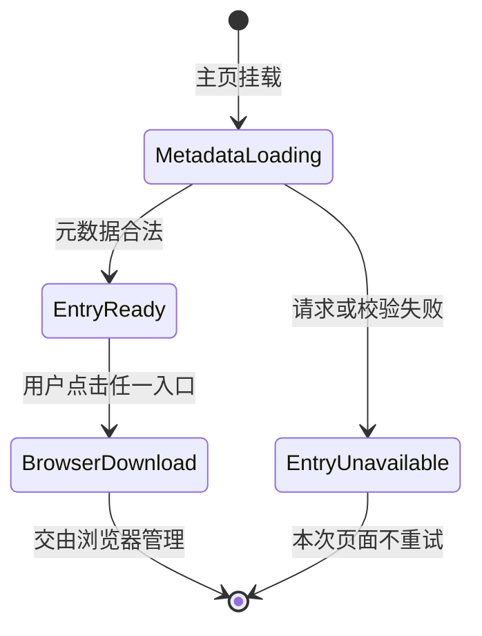

# 数据模型：统一 Android APK 下载入口

## 1. 下载元数据 `LatestAPKMetadata`

沿用现有公开 DTO，不新增字段。

| 字段 | 类型 | 前端合法性规则 | 用途 |
|------|------|----------------|------|
| `platform` | enum | 必须为 `android` | 防止消费错误平台 |
| `status` | enum | 必须为 `available` | 表示检查时可下载 |
| `versionName` | string | 非空 | 三语入口展示 |
| `versionCode` | integer | 大于 0 | 完整性事实，不直接展示 |
| `fileName` | string | 非空且不含 `/`、`\` | 原生链接建议文件名 |
| `sizeBytes` | integer | 大于 0 | 按当前 locale 格式化 |
| `lastUpdated` | date string | `YYYY-MM-DD` | 当前事实日期 |
| `downloadUrl` | stable path | 必须为公开稳定下载地址 | 两处入口唯一目标 |

## 2. 共享可用性状态 `DownloadMetadataState`

```text
loading
  ├── 合法 available metadata ──> ready(metadata)
  └── 网络/HTTP/JSON/字段失败 ──> unavailable
```

### 状态定义

| 状态 | 元数据 | 两处入口 | APK 请求 |
|------|--------|----------|----------|
| `loading` | `null` | 不可操作，显示检查中 | 0 |
| `ready` | 合法 `LatestAPKMetadata` | 原生下载链接 | 用户点击后 1 次 |
| `unavailable` | `null` | 不可操作，显示暂不可用 | 0 |

### 状态不变量

- 同一 `document` 只能创建一个 in-flight metadata Promise。
- 状态只能从 `loading` 进入 `ready` 或 `unavailable`；本次页面生命周期不自动重试。
- 语言切换不改变状态，也不重新请求，只重新格式化 `sizeBytes` 和文案。
- Hero 与中下部不保存本地下载状态，不能产生互相矛盾的状态。

## 3. 派生下载动作 `AndroidDownloadActionState`

这是 UI 派生状态，不是新的服务端实体。

| Provider 状态 | 元素语义 | `href` | `download` | 辅助语义 |
|---------------|----------|--------|------------|----------|
| `loading` | 不可操作控件 | 无 | 无 | `disabled`/`aria-disabled`，检查中文案 |
| `ready` | 链接 | `metadata.downloadUrl` | `metadata.fileName` | 可见焦点，描述版本与大小 |
| `unavailable` | 不可操作控件 | 无 | 无 | `disabled`/`aria-disabled`，不可用文案 |

两处入口允许视觉样式不同，但上述元素语义和属性必须相同。

## 4. 下载生命周期边界



`BrowserDownload` 离开前端状态机后，页面不跟踪：

- 网络下载百分比；
- 暂停、继续、取消；
- 浏览器落盘是否完成；
- APK 是否安装；
- Android 是否授予未知来源安装权限。

## 5. i18n 派生

| 语义 | `zh-Hant` | `zh-Hans` | `en` |
|------|-----------|-----------|------|
| loading | 正在檢查下載… | 正在检查下载… | Checking download… |
| ready | 下載 Android APK | 下载 Android APK | Download Android APK |
| unavailable | Android APK 暫時未能下載 | Android APK 暂时无法下载 | Android APK is temporarily unavailable |

可用状态附加 `{versionName} · {localized size}`；不把版本和大小静态写入内容 manifest。

## 6. 与匿名统计的关系

- metadata 请求到达后端：继续按既有规则记录 `page_view`，无论成功或失败。
- 原生链接请求 APK：继续按既有规则记录 `download_request`。
- `loading/unavailable` 不产生 APK 请求，也不产生虚假的 download event。
- 服务端成功响应仍只代表成功形成/写出 APK 响应，不代表浏览器完整接收或安装。
