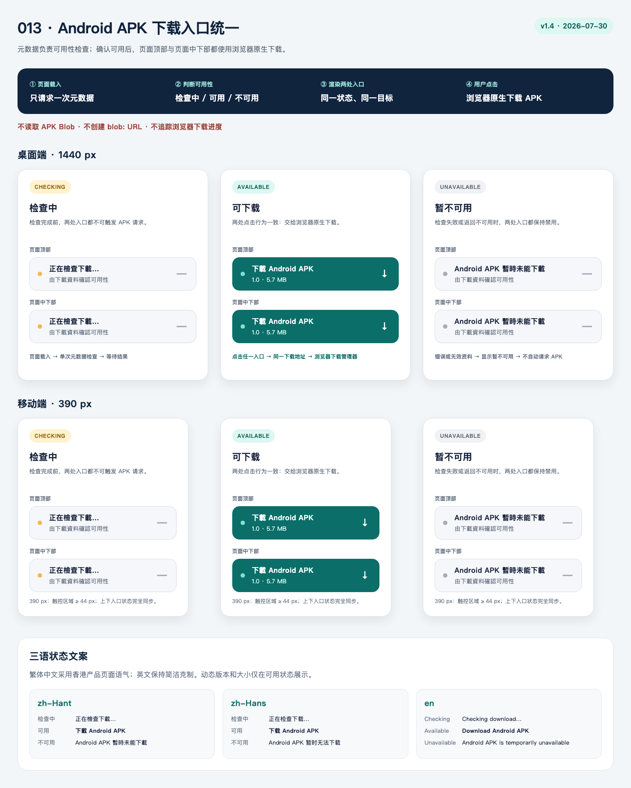
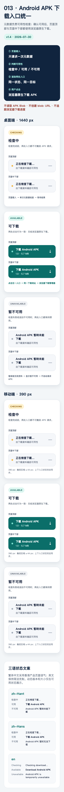

# Figma 设计引用：统一 Android APK 下载入口

## 文件与版本

- 设计文件：
  [BusIsComing Website Homepage v1 Spec](https://www.figma.com/design/LAm6RjzFuFHsHFlcipx8pU/BusIsComing-Website---Homepage-v1-Spec)
- 本功能状态板：
  [`013 / APK Download Alignment / v1.4` 根节点 `108:2`](https://www.figma.com/design/LAm6RjzFuFHsHFlcipx8pU/BusIsComing-Website---Homepage-v1-Spec?node-id=108-2&p=f)
- 既有下载交互状态基线：
  [`4:326`](https://www.figma.com/design/LAm6RjzFuFHsHFlcipx8pU/BusIsComing-Website---Homepage-v1-Spec?node-id=4-326)
- 版本：`v1.4`
- 日期：2026-07-30
- Feature：`013-unify-apk-download`

## 当前交付状态

用户已使用 `html.to.design` 把 [HTML 状态板](./prototype/index.html) 导入既有 Homepage v1
Spec，并提供可直接定位的根节点 `108:2`。该根节点是本 feature 的 Figma 追溯入口，内部按可见
标题包含桌面/手机三态、两个下载位置、三语状态文案和交互契约。

本次复核使用了与导入内容相同的无损源和双端截图：

- [HTML 状态板](./prototype/index.html)
- [桌面 1440 截图](./prototype/desktop-1440.png)
- [手机 390 截图](./prototype/mobile-390.png)

## 节点定位

| 可见标签 | 内容 | 定位方式 |
|----------|------|----------|
| `013 / APK Download Alignment / v1.4` | 总状态板 | Figma 根节点 `108:2` |
| `Desktop / CHECKING / 1440` | 桌面检查中，顶部与中下部 | 根节点内按标签定位 |
| `Desktop / AVAILABLE / 1440` | 桌面可用，两个原生下载入口 | 根节点内按标签定位 |
| `Desktop / UNAVAILABLE / 1440` | 桌面不可用，两个禁用入口 | 根节点内按标签定位 |
| `Mobile / CHECKING / 390` | 手机检查中 | 根节点内按标签定位 |
| `Mobile / AVAILABLE / 390` | 手机可用 | 根节点内按标签定位 |
| `Mobile / UNAVAILABLE / 390` | 手机不可用 | 根节点内按标签定位 |
| `Three-locale Copy` | `zh-Hant`、`zh-Hans`、`en` 三语状态文案 | 根节点内按标签定位 |
| `Interaction Contract` | metadata → shared state → native download | 根节点内按标签定位 |

`108:2` 已足以在一个状态板中追溯所有设计状态，因此不虚构导入后未独立核验的子节点 ID。

## 交互规则

1. 页面载入时只有 metadata 请求，不请求 APK。
2. checking 和 unavailable 中两个 Android 入口都不可操作。
3. available 中两个入口视觉位置不同，但都使用同一稳定地址与文件名。
4. 点击 available 入口后交给浏览器下载管理器，页面不出现进度。
5. 三态切换保持近似尺寸，不造成内容跳动。
6. iPhone 只读状态保持不变。

## 视觉复核

- 1440 与 390 状态板均完整包含 checking、available、unavailable。
- 两处入口在每种状态下保持相同语义和目标；available 才显示版本与大小。
- 手机卡片没有水平滚动、文字遮挡或低于 44px 的主操作区域。
- `zh-Hant`、`zh-Hans`、`en` 状态文案均出现在同一状态板。
- 未发现裁切、重叠、占位文案或与本地原稿不一致。

## 当前连接验证限制

2026-07-30 复核时，Figma 元数据、截图和 `use_figma` 接口对该文件统一返回
`INVALID_ARGUMENT`，Chrome 中的 Figma 页面也未能在自动化等待时限内完成加载。因此本文件只
声明用户确认的根节点和已实际复核的导入源，不声称已由自动连接重新导出 Figma screenshot 或
枚举子节点 ID。该限制不阻塞从 `108:2` 定位设计，但 T026 在实现完成后仍需用可用的 Figma
会话更新最终节点截图和版本说明。

## 实施门禁结论

Figma 设计门禁已满足：既有 Homepage v1 Spec 中存在用户确认的 `v1.4` 根节点，三态、双入口、
双端与三语基线可由同一链接和本地截图复核。前端实现可继续；最终 UI 完成仍须执行 T018、
T019 和 T026，与真实 1440/390 页面截图逐项对照。
